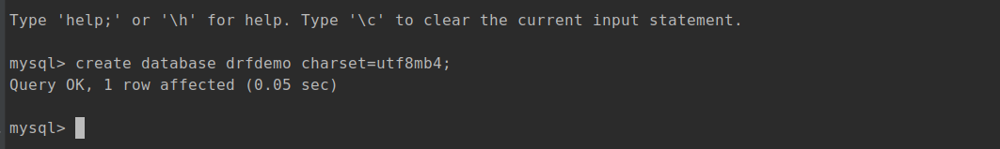
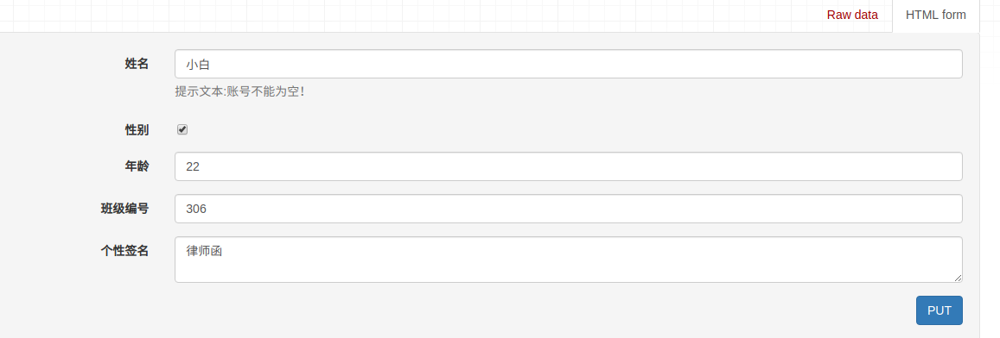
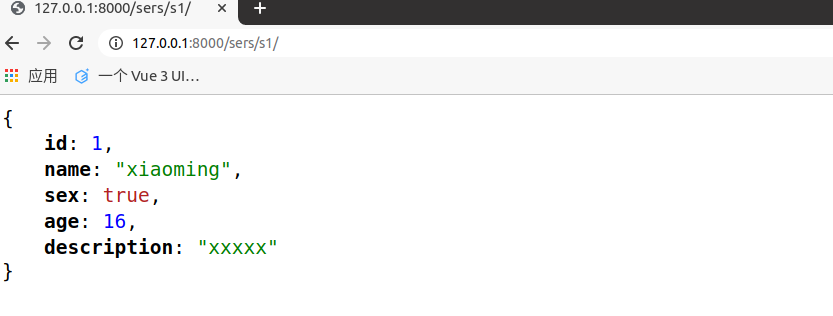
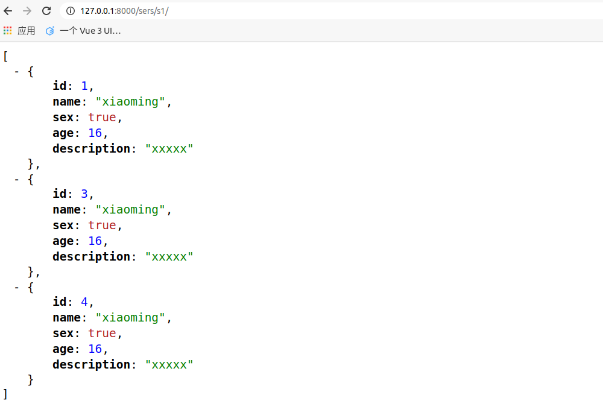

#  1. Web应用模式

在开发Web应用中，有两种应用模式：

1. 前后端不分离[客户端看到的内容和所有界面效果都是由服务端提供出来的。]


2. 前后端分离【把前端的界面效果(html，css，js分离到另一个服务端或另一个目录下，python服务端只需要返回数据即可)】

    前端形成一个独立的网站/独立的地址，服务端构成一个独立的网站


# 2. api接口

应用程序编程接口（Application Programming Interface，API接口），就是服务端应用程序对外界提供了一个操作数据的入口，这个入口可以是一个函数或类方法，也可以是一个url地址或者一个网络地址。当客户端调用这个入口，服务端应用程序则会执行对应代码操作，给客户端完成相对应的功能。

当然，api接口在工作中是比较常见的开发内容，有时候我们会调用其他人编写的api接口，有时候，我们也需要提供api接口给其他人操作。由此就会带来一个问题，api接口往往都是一个函数、类方法、或者url或其他网络地址，不断是哪一种，当api接口编写过程中，我们都要考虑一个问题就是这个接口应该怎么编写？接口怎么写的更加容易维护和清晰，这就需要大家在调用或者编写api接口的时候要有一个明确的编写规范！！！


为了在团队内部形成共识、防止个人习惯差异引起的混乱，我们都需要找到一种大家都觉得很好的接口实现规范，而且这种规范能够让后端写的接口，用途一目了然，减少客户端和服务端双方之间的合作成本。

目前市面上大部分公司开发人员使用的接口实现规范主要有：restful、RPC。

RPC（ Remote Procedure Call ）: 翻译成中文: 远程过程调用[远程服务调用]. 从字面上理解就是访问/调用远程服务端提供的api接口。这种接口一般以服务或者过程式代码提供。

+ 服务端提供一个**唯一的访问入口地址**：http://api.xxx.com/ 或 http://www.xx.com/api

+ 客户端请求服务端的时候，所有的操作都理解为**动作**(action)，如果是web开发时，对应的就是HTTP请求的post请求

+ 通过**请求体或查询字符串**参数表达动作具体意义，指定要调用的接口名称和接口所需的参数

  http://api.xxx.com/?action=get_all_student&class=301&sex=1

  http://api.xxx.com/?method=create_student&sex=1&age=22

  http://api.xxx.com/?command=100&sex=1&age=22

+ 基本上现有rpc的数据传输格式：protobuf（go语言的gRPC框架）、json、xml

RPC的优点很明显，因为是单一入口，所以容易实现一些垂直业务，类似权限，限流，同时因为rpc直接通过请求体或查询参数直接表达对服务端的操作，所以相对比较直观，一目了然，而且因为函数名都是开发者自定义的，所以非常灵活。但是rpc的缺点也很明显，当RPC接口多了，对应函数名和参数也就多了，客户端在请求服务端的api接口时就比较难找，对于年代久远的rpc服务端的代码也容易出现重复的接口。


restful: 翻译成中文: 资源状态转换(表征性状态转移)

+ 把服务端提供的所有的数据/文件都看成资源，而资源在服务端存储过程中往往使用了不同的外观图标或不同的文件扩展名，所以这些资源的外观特征也称之为资源的表征性， 那么客户端通过api接口请求服务端进行数据操作，本质上来说就是对服务端的资源的操作了，而客户端对服务端的资源操作一般都多种不同的行为，例如添加、删除或修改一个资源，这种情况对于资源来说，就是状态的转换。

  restful中要求，我们把当前接口对外提供哪种资源进行操作，就把**资源的名称写在url地址**。资源都是名词，例如数据表名，例如文件名。

  http://api.xxx.com/students/

  http://api.xxx.com/avatars/

+ web开发中操作资源，最常见的最通用的无非就是增删查改，所以restful要求在地址栏中声明要操作的资源是什么。然后通过**http请求方法**来说明对该资源进行哪一种操作。

  | HTTP请求方法 | api接口地址                             | 描述                                             |
| ------------ | --------------------------------------- | ------------------------------------------------ |
  | POST         | `http://www.xxx.com/api/students/`      | 添加学生数据                                     |
| GET          | `http://www.xxx.com/api/students/`      | 获取所有学生数据                                 |
  | GET          | `http://www.xxx.com/api/students/<pk>/` | 获取id=pk的学生信息                              |
| DELETE       | `http://www.xxx.com/api/students/`      | 删除所有学生                                     |
  | DELETE       | `http://www.xxx.com/api/students/<pk>/` | 删除id=pk的一个学生                              |
| PUT          | `http://www.xxx.com/api/students/<pk>/` | 修改id=pk的一个学生的全部信息 [id,name,sex,age,] |
  | PATCH        | `http://www.xxx.com/api/students/<pk>/` | 修改id=pk的一个学生的部分信息[age]               |

也就是说，我们仅需要通过url地址上的资源名称结合HTTP请求动作，就可以说明当前api接口的功能是什么了。

restful是多入口的，以**资源**为主的api接口规范，体现在地址上就是资源就是以名词表达。

rpc则是单入口的，以**动作**为主的api接口规范，体现在接口名称上往往附带操作数据的动作。

# 3. RESTful API规范


REST全称是Representational State Transfer，中文意思是表述（编者注：通常译为表征）性状态转移。 它首次出现在2000年Roy Fielding的博士论文中。

RESTful是一种专门为Web 开发而定义API接口的设计风格，尤其适用于前后端分离的应用模式中。

这种风格的理念认为后端开发任务就是提供数据的，对外提供的是数据资源的访问接口，所以在定义接口时，客户端访问的URL路径就表示这种要操作的数据资源。

而对于数据资源分别使用POST、DELETE、GET、UPDATE等请求动作来表达对数据的增删查改。

| 请求方法 | 请求地址       | 后端操作           |
| -------- | -------------- | ------------------ |
| GET      | /students      | 获取所有学生       |
| POST     | /students      | 增加学生           |
| GET      | /students/<pk> | 获取编号为pk的学生 |
| PUT      | /students/<pk> | 修改编号为pk的学生 |
| DELETE   | /students/<pk> | 删除编号为pk的学生 |

restful规范是一种通用的规范，不限制语言和开发框架的使用。事实上我们可以使用任何一门语言，任何一个框架都可以实现符合restful规范的API接口。

参考文档：http://www.runoob.com/w3cnote/restful-architecture.html


## api接口的幂等性

api接口实现过程中会存在**幂等性**问题。所谓幂等性是指代**客户端发起多次同样请求时，是否对于服务端里面的资源产生不同结果**。如果**多次请求**，服务端**结果**还是**一样**，则属于**幂等接口**，如果多次请求，服务端产生结果是不一样的，则属于非幂等接口。

| 请求方式  | 是否幂等 | 是否安全 |
| --------- | -------- | -------- |
| GET       | 幂等     | 安全     |
| POST      | 不幂等   | 不安全   |
| PUT/PATCH | 幂等     | 不安全   |
| DELETE    | 幂等     | 不安全   |

针对幂等不安全的接口，要进行参数的校验。针对不幂等不安全的接口，要做幂等性校验。

如果做幂等性校验呢？所以幂等性校验就是为了避免对于同一个接口反复提交。

1. 增加唯一判断，给提交的数据字段，设置唯一索引
2. 给提交的数据增加一个随机数（uuid），如果两次提交的数据随机数是一样的，则表示重复提交。
3. 限流，或强制刷新


# 4. 序列化

api接口开发，最核心最常见的一个代码编写过程就是序列化，所谓序列化就是把**数据转换格式**。常见的序列化方式：

json，pickle，base64，struct，….

序列化可以分两个阶段：

**序列化**： 把我们识别的数据转换成指定的格式提供给别人。

例如：我们在django中获取到的数据默认是模型对象，但是模型对象数据无法直接提供给前端或别的平台使用，所以我们需要把数据进行序列化，变成字符串或者json数据，提供给别人。

**反序列化**：把别人提供的数据转换/还原成我们需要的格式。

例如：前端js提供过来的json数据，对于python而言json就是字符串，我们需要进行反序列化换成字典，然后接着字典再进行转换成模型对象，这样我们才能把数据保存到数据库中。

# 5. Django Rest_Framework

核心思想: 大量缩减编写api接口的代码

Django REST framework是一个建立在Django基础之上的Web 应用开发框架，可以快速的开发REST API接口应用。在REST framework中，提供了序列化器Serialzier的定义，可以帮助我们简化序列化与反序列化的过程，不仅如此，还提供丰富的类视图、扩展类、视图集来简化视图的编写工作。REST framework还提供了认证、权限、限流、过滤、分页、接口文档等功能支持。REST framework还提供了一个调试API接口 的Web可视化界面来方便查看测试接口。


中文文档：https://q1mi.github.io/Django-REST-framework-documentation/#django-rest-framework

github: https://github.com/encode/django-rest-framework/tree/master

### 特点

- 提供了定义序列化器Serializer的方法，可以快速根据 Django ORM 或者其它库自动序列化/反序列化；
- 提供了丰富的类视图、Mixin扩展类，简化视图的编写；
- 丰富的定制层级：函数视图、类视图、视图集合到自动生成 API，满足各种需要；
- 多种身份认证和权限认证方式的支持；[jwt]
- 内置了限流系统；
- 直观的 API web 界面；【方便我们调试开发api接口】
- 可扩展性，插件丰富


# 6. 环境安装与配置

DRF需要以下依赖：

- Python (3.5 以上)
- Django (2.2 以上)

**DRF是以Django子应用的方式提供的，所以我们可以直接创建Django环境**。


## 6.1 安装DRF

anaconda (内置180多个python模块，)/ miniconda（内置仅仅是30多个常用模块）

创建虚拟环境，安装django等相关模块

```python
conda create -n drfdemo python=3.10

conda activate drfdemo

pip install django  -i https://pypi.douban.com/simple
pip install djangorestframework -i https://pypi.douban.com/simple

# 因为我们需要接下来需要开发api接口肯定要操作数据库，所以安装pymysql
pip install pymysql -i https://pypi.douban.com/simple
```


### 6.1.1 创建django项目

```
cd ~/Desktop
django-admin startproject drfdemo
```


使用pycharm打开项目，设置虚拟环境的解析器，并修改manage.py中的后缀参数。


## 6.2 添加rest_framework应用

在**settings.py**的**INSTALLED_APPS**中添加'rest_framework'。

```python
INSTALLED_APPS = [
    ...
    'rest_framework',
]
```

接下来就可以使用DRF提供的功能进行api接口开发了。在项目中如果使用rest_framework框架实现API接口，视图中主要有以下三个步骤：

- 将请求的数据（如JSON格式）转换为模型类对象
- 操作数据库
- 将模型类对象转换为响应的数据（如JSON格式）


接下来，我们快速体验下几天后我们学习完成drf以后的开发代码。接下来代码不需要理解，看步骤。

## 6.3 体验drf完全简写代码的过程

```bash
5个接口：
    添加1条数据
    获取所有数据
    获取1条数据
    更新1条数据
    删除1条数据

# 终端下执行：
django-admin startapp stuapi    # 提供原生的django代码实现的API接口
django-admin startapp students  # 提供drf代码实现的API接口
```

把新建的子应用先统一注册到settings.py，代码：

```python
INSTALLED_APPS = [
    'django.contrib.admin',
    'django.contrib.auth',
    'django.contrib.contenttypes',
    'django.contrib.sessions',
    'django.contrib.messages',
    'django.contrib.staticfiles',

    'rest_framework',

    'stuapi',    # 不使用drf编写api接口
    'students',  # 使用了drf编写api接口
]
```


### 6.3.1. 创建模型操作类

stuapi/models.py，代码：

```python
from django.db import models


# Create your models here.
class Student(models.Model):
    """学生信息"""
    name = models.CharField(max_length=255, verbose_name="姓名")
    sex = models.BooleanField(default=True, verbose_name="性别")
    age = models.IntegerField(verbose_name="年龄")
    classmate = models.CharField(db_column="class", max_length=5, verbose_name="班级编号")
    description = models.TextField(max_length=1000, null=True, blank=True, verbose_name="个性签名")

    class Meta:
        db_table = "tb_student"
        verbose_name = "学生"
        verbose_name_plural = verbose_name

    def __str__(self):
        return str(self.__dict__)

```

为了方便测试，所以我们可以先创建一个数据库。

```
mysql -uroot -p123
create database drfdemo charset=utf8mb4;
```



#### 6.3.1.1 执行数据迁移

主引用中`__init__.py`设置使用pymysql作为数据库驱动

```python
import pymysql
pymysql.install_as_MySQLdb()
```

settings.py配置文件中设置mysql的账号密码

```python
# Database
# https://docs.djangoproject.com/en/4.0/ref/settings/#databases

DATABASES = {
    'default': {
        'ENGINE': 'django.db.backends.mysql',
        'NAME': "drfdemo",
        "HOST": "127.0.0.1",
        "PORT": 3306,
        "USER": "root",
        "PASSWORD": "123",
    },
}
```


终端下，执行数据迁移。

```bash
python manage.py makemigrations
python manage.py migrate
```


这里我们先使用原生的Django代码提供基本API接口，stuapi/views.py，代码：

```python
import json

from django.views import View
from django.http.response import JsonResponse
from .models import Student

# Create your views here.
"""
POST /students/   添加一个学生信息
GET  /students/   获取所有学生信息

GET /students/<pk>/  获取一个学生信息
PUT /students/<pk>/  更新一个学生信息
DELETE /students/<pk>/  删除一个学生信息
 
一个路由对应一个视图类，所以我们可以把5个API分成2个类来完成
"""


class StudentView(View):
    """学生视图"""

    def post(self, request):
        """添加一个学生信息"""
        # 1. 接收客户单提交的数据，验证客户端的数据
        data = json.loads(request.body)
        name = data.get("name")
        sex = data.get("sex")
        age = data.get("age")
        classmate = data.get("classmate")
        description = data.get("description")

        # 2. 操作数据库，保存数据
        instance = Student.objects.create(
            name=name,
            sex=sex,
            age=age,
            classmate=classmate,
            description=description,
        )

        # 3. 返回结果
        return JsonResponse(data={
            "id": instance.pk,
            "name": instance.name,
            "sex": instance.sex,
            "age": instance.age,
            "classmate": instance.classmate,
            "description": instance.description,
        }, status=201)

    def get(self, request):
        """获取多个学生信息"""
        # 1. 读取数据库
        students_list = list(Student.objects.values())

        # 2. 返回数据
        return JsonResponse(data=students_list, status=200, safe=False)


class StudentInfoView(View):
    def get(self, request, pk):
        """获取一条数据"""
        try:
            instance = Student.objects.get(pk=pk)
            return JsonResponse(data={
                "id": instance.pk,
                "name": instance.name,
                "sex": instance.sex,
                "age": instance.age,
                "classmate": instance.classmate,
                "description": instance.description,
            }, status=200)

        except Student.DoesNotExist:
            return JsonResponse(data=None, status=404)  # 没有内容

    def put(self, request, pk):
        """更新一个学生信息"""
        # 1. 接收客户单提交的数据，验证客户端的数据
        data = json.loads(request.body)
        name = data.get("name")  # alt+j 选中多个一样的
        sex = data.get("sex")
        age = data.get("age")
        classmate = data.get("classmate")
        description = data.get("description")

        # 2. 操作数据库，保存数据
        try:
            instance = Student.objects.get(pk=pk)
            instance.name = name
            instance.sex = sex
            instance.age = age
            instance.classmate = classmate
            instance.description = description
            instance.save()

        except Student.DoesNotExist:
            return JsonResponse(data={}, status=404)  # 没有内容

        # 3. 返回结果
        return JsonResponse(data={
            "id": instance.pk,
            "name": instance.name,
            "sex": instance.sex,
            "age": instance.age,
            "classmate": instance.classmate,
            "description": instance.description,
        }, status=201)

    def delete(self, request, pk):
        """删除一个学生信息"""
        try:
            Student.objects.filter(pk=pk).delete()
        except:
            pass
        return JsonResponse(data={}, status=204)

```

子应用下创建urls.py，代码：

```python
from django.urls import path,re_path
from . import views
urlpatterns = [
    path("students/", views.StudentView.as_view()),
    re_path("^students/(?P<pk>\d+)/$", views.StudentInfoView.as_view()),
]

```

在settings.py，关闭CSRF中间件：

```python
MIDDLEWARE = [
    'django.middleware.security.SecurityMiddleware',
    'django.contrib.sessions.middleware.SessionMiddleware',
    'django.middleware.common.CommonMiddleware',
    # 'django.middleware.csrf.CsrfViewMiddleware',
    'django.contrib.auth.middleware.AuthenticationMiddleware',
    'django.contrib.messages.middleware.MessageMiddleware',
    'django.middleware.clickjacking.XFrameOptionsMiddleware',
]
```

总路由，urls.py，代码：

```python
from django.contrib import admin
from django.urls import path, include

urlpatterns = [
    path('admin/', admin.site.urls),
    path('api/', include("stuapi.urls")),
]

```

访问效果：

```bash
GET  http://localhost:8000/api/students/

POST http://localhost:8000/api/students/
Content-Type: application/json

{
    "name": "xiaoming",
    "age": 18,
    "sex": true,
    "classmate": 301,
    "description": "hello,"
}


GET  http://localhost:8000/api/students/2/

PUT  http://localhost:8000/api/students/2/
Content-Type: application/json

{
    "name": "xiaoming",
    "age": 16,
    "sex": true,
    "classmate": 301,
    "description": "hello,"
}

DELETE http://localhost:8000/api/students/2/

```


接下来，我们可以采用django_restframework来完成上面的5个API接口。具体代码编写到另一个子应用students。

### 6.3.2. 创建序列化器

因为上面的django原生代码编写的API接口中，已经编写了一个学生信息的模型，所以直接采用之前命名的模型即可。

在students应用目录中新建serializers.py用于保存该应用的序列化器。

创建一个StudentModelSerializer用于序列化与反序列化。

```python
# 创建序列化器类，回头会在视图中被调用
from rest_framework import serializers
from stuapi.models import Student


class StudentModelSerializer(serializers.ModelSerializer):

    class Meta:
        model = Student
        fields = "__all__"
        # fields = ["id","name","age"]

```

- **model** 指明该序列化器处理的数据字段从模型类BookInfo参考生成
- **fields** 指明该序列化器包含模型类中的哪些字段，'__all__'指明包含所有字段


### 6.3.3. 编写视图

在students应用的views.py中创建视图StudentModelViewSet，这是一个视图集合。

```python
from rest_framework.viewsets import ModelViewSet
from stuapi.models import Student
from .serializers import StudentModelSerializer
# Create your views here.


class StudentModelViewSet(ModelViewSet):
    queryset = Student.objects.all()
    serializer_class = StudentModelSerializer

```

- **queryset** 指明该视图集在查询数据时使用的查询集
- **serializer_class** 指明该视图在进行序列化或反序列化时使用的序列化器

### 6.3.4. 定义路由

在students应用的urls.py中定义路由信息。

```python
from rest_framework.routers import DefaultRouter
from . import views

router = DefaultRouter()
router.register("students2", views.StudentModelViewSet, basename="students2"),

# 路由列表
urlpatterns = [

] + router.urls
```

最后把students子应用中的路由文件加载到总路由文件中.

```python
from django.contrib import admin
from django.urls import path, include

urlpatterns = [
    path('admin/', admin.site.urls),
    path('api/', include("stuapi.urls")),
    path('api/', include("students.urls")),
]

```


### 6.3.5. 运行测试

运行当前程序（与运行Django一样）

```shell
python manage.py runserver
```

在浏览器中输入网址127.0.0.1:8000/api，可以看到DRF提供的API Web浏览页面：


1）点击链接127.0.0.1:8000/api/students2/ 可以访问**获取所有数据的接口**，呈现如下页面：


2）在页面底下表单部分填写学生信息，可以访问**添加新学生的接口**，保存学生信息：


点击POST后，返回如下页面信息：


3）在浏览器中输入网址127.0.0.1:8000/api/api/students2/1/，可以访问**获取单一学生信息的接口**（id为5的学生），呈现如下页面：


4）在页面底部表单中填写学生信息，可以访问**修改学生的接口**：



点击PUT，返回如下页面信息：


5）点击DELETE按钮，可以访问**删除学生的接口**：


返回，如下页面：


# 7. 序列化器-Serializer

作用：

    1. 序列化，序列化器会把模型对象转换成字典，经过视图中response对象以后变成json字符串
    2. 反序列化，视图中request会把客户端发送过来的数据转换成字典，序列化器可以把字典转成模型
    3. 反序列化，把客户端发送过来的数据进行校验，并存储入库


## 7.1 定义序列化器

Django REST framework中的Serializer使用类来定义，必须直接或间接继承于rest_framework.serializers.Serializer。

接下来，为了方便演示序列化器的使用，我们先创建一个新的子应用sers

```
python manage.py startapp sers
```

序列化器注册到项目中。

settings.py，代码：

```python
# Application definition

INSTALLED_APPS = [
    'django.contrib.admin',
    'django.contrib.auth',
    'django.contrib.contenttypes',
    'django.contrib.sessions',
    'django.contrib.messages',
    'django.contrib.staticfiles',

    'rest_framework',

    'stuapi',    # 不使用drf编写api接口
    'students',  # 使用了drf编写api接口
    'sers',      # 演示序列化的使用
]

```


我们已有了一个数据库模型类stuapi/Student，我们想为这个Student模型类提供一个序列化器类，可以定义如下，sers/serializers.py，代码：

```python
from rest_framework import serializers
"""
rest_framework.serializers 是drf提供给开发者调用的序列化器模块
里面声明了所有的可用序列化器的基类，常用的有：
Serializer      序列化器基类，drf中所有的序列化器类都必须继承于 Serializer
ModelSerializer 模型序列化器基类，是序列化器基类Serializer的子类，在工作中，除了Serializer基类以外，最常用的序列化器类基类
"""

class StudentSerializer(serializers.Serializer):
    """学生信息序列化器"""
    # 1. 转换的字段声明
    id = serializers.IntegerField()
    name = serializers.CharField()
    sex = serializers.BooleanField()
    age = serializers.IntegerField()
    description = serializers.CharField()

    # 2. 如果当前序列化器继承的是ModelSerializer，则需要声明调用的模型信息
    # class Meta:
    #     model = 模型
    #     fields = "__all__"
    #     fields = ["字段1","字段2",....]

    # 3. 验证代码的对象方法
    # def validate(self, attrs): # 方法名validate是固定的，attrs就是客户端发送的数据，字典格式
    #     pass
    #     return attrs

    # def validate_<字段名>(self, data):  # 方法名的格式必须以 validate_<字段名> 为名称，否则序列化器不识别！
    #     pass
    #     return data


    # 4. 模型操作的扩展方法
    # def create(self, validated_data):  # 添加数据操作，添加数据以后，就自动实现了从字典变成模型对象的过程
    #     pass
    #
    # def update(self, instance, validated_data): # 更新数据操作，更新数据以后，就自动实现了从字典变成模型对象的过程
    #     pass

```

**注意：serializer不是只能为数据库模型类转换数据格式，也可以为非数据库模型类的转换数据格式。**serializer是独立于数据库之外的存在。

serailziers中的字段声明时提供给客户端的，所以常用字段类型：

| 序列化器<br>字段    | 模型<br>字段                                         | 序列化器字段选项                                             |
| ------------------- | ---------------------------------------------------- | ------------------------------------------------------------ |
| **BooleanField**    | BooleanField                                         | BooleanField()                                               |
| **CharField**       | CharField<br>TextField等                             | CharField(<br>max_length=最大长度, min_length=最小长度, <br>allow_blank=False,  表示是否允许客户端提交空字符串，False表示不允许<br>trim_whitespace=True，表示是否移除字符串两边的空白字符，True表示移除<br>) |
| **EmailField**      | EmailField                                           | EmailField(max_length=None, min_length=None, allow_blank=False) |
| **RegexField**      | CharField                                            | RegexField(regex=正则表达式, max_length=None, min_length=None, allow_blank=False) |
| SlugField           | SlugField                                            | SlugField(max_length=50, min_length=None, allow_blank=False) <br>正则字段，验证正则模式 [a-zA-Z0-9*-]+ |
| **URLField**        | URLField                                             | URLField(max_length=200, min_length=None, allow_blank=False) |
| **UUIDField**       | UUIDField                                            | UUIDField(format='hex_verbose')  <br>format:  设置UUID格式，一般默认使用hex_verbose<br>`'hex_verbose'` 如`"5ce0e9a5-5ffa-654b-cee0-1238041fb31a"`  <br>`'hex'` 如 `"5ce0e9a55ffa654bcee01238041fb31a"`  <br>`'int'` - 如: `"123456789012312313134124512351145145114"` <br> `'urn'` 如: `"urn:uuid:5ce0e9a5-5ffa-654b-cee0-1238041fb31a"` |
| **IPAddressField**  | IPAddressField                                       | IPAddressField(protocol='both', unpack_ipv4=False, **options) |
| **IntegerField**    | SmallIntegerFiled<br>IntegerField<br>BigIntegerField | IntegerField(max_value=最大值, min_value=最小值)             |
| FloatField          | FloatField                                           | FloatField(max_value=None, min_value=None)                   |
| **DecimalField**    | DecimalField                                         | DecimalField(<br>max_digits=数值的数字总个数, decimal_places=小数位个数, coerce_to_string=None, max_value=None, min_value=None) |
| **DateTimeField**   | DateTimeField                                        | DateTimeField(<br>format=api_settings.DATETIME_FORMAT, 表示日期格式<br>input_formats=None) |
| DateField           | DateField                                            | DateField(format=api_settings.DATE_FORMAT, input_formats=None) |
| TimeField           | TimeField                                            | TimeField(format=api_settings.TIME_FORMAT, input_formats=None) |
| DurationField       | DurationField                                        | DurationField()                                              |
| ChoiceField         | 对应整型或字符串中的choices=属性选项                 | ChoiceField(choices=元祖选项) choices与Django的用法相同      |
| MultipleChoiceField | 对应整型或字符串中的choices=属性选项                 | MultipleChoiceField(choices=元祖选项) choices与Django的用法相同 |
| **FileField**       | FileField                                            | FileField(max_length=None, allow_empty_file=False, use_url=UPLOADED_FILES_USE_URL) |
| **ImageField**      | ImageField                                           | ImageField(max_length=None, allow_empty_file=False, use_url=UPLOADED_FILES_USE_URL) |
| ListField           | python里面的List                                     | ListField(child=模型列表, min_length=None, max_length=None)  |
| DictField           | python里面的Dict                                     | DictField(child=模型对象)                                    |

字段的选项参数：

| 参数名称            | 作用                   |
| ------------------- | ---------------------- |
| **max_length**      | 最大长度               |
| **min_lenght**      | 最小长度               |
| **allow_blank**     | 是否允许为空字符串     |
| **trim_whitespace** | 是否移除两边的空白字符 |
| **max_value**       | 最小数值               |
| **min_value**       | 最大数值               |

字段的通用选项参数：

| 参数名称           | 说明                                                         |
| ------------------ | ------------------------------------------------------------ |
| **read_only**      | 表明该字段仅用于序列化输出，默认False                        |
| **write_only**     | 表明该字段仅用于反序列化输入，默认False                      |
| **required**       | 表明该字段在反序列化时必须输入，默认True                     |
| **default**        | 反序列化时使用的默认值                                       |
| **miss**           | 序列化时使用的默认值                                         |
| **allow_null**     | 表明反序列化时该字段是否允许传入None，默认False              |
| **validators**     | 表明反序列化时该字段使用的验证器函数                         |
| **error_messages** | 表明反序列化时如果验证出错了，返回错误错误信息的字典         |
| **label**          | 用于HTML展示API页面时，显示的字段名称。<br>如果不写，则默认采用模型的verbose_name，但是前提是当前序列化器继承ModelSerializer |
| **help_text**      | 用于HTML展示API页面时，显示的字段帮助提示信息<br/>如果不写，则默认采用模型的help_text，但是前提是当前序列化器继承ModelSerializer |


## 7.2 创建Serializer对象

定义好Serializer类后，就可以创建Serializer对象了。

Serializer的构造方法为：

```python
序列化器(instance=None, data=empty, many=False, context=None, **kwargs)
```

说明：

1）序列化器用于序列化时，则需要将模型类对象传入**instance**参数

2）序列化器用于反序列化时，将要被反序列化的数据传入**data**参数

3）序列化器用于序列化时，当instance的值是一个QuerySet类型，则需要声明many=True

4）除了以上参数外，在构造Serializer对象时，还可通过**context**参数额外添加数据传入到序列化器中。

常见的写法：

```python
serializer = Student1Serializer(instance=student) # 序列化单个模型对象为dict字典
serializer = Student1Serializer(instance=student_list, many=True)  # 序列化多个模型对象为list列表
serializer = Student1Serializer(instance=student_list, context={'request': request}) # 如果传递数据到序列化器中，可以使用context
```

**通过context参数附加的数据，可以通过Serializer对象的context属性获取。**

1. 使用序列化器的时候一定要注意，序列化器声明了以后，不会自动执行，需要我们在视图中进行调用才可以。
2. 序列化器无法直接接收数据，需要我们在视图中实例化序列化器对象时把使用的数据通过instance传递过来。
3. 序列化器的字段声明类似于我们前面使用过的模型。
4. 开发restful api时，序列化器会帮我们把模型对象转换成字典


## 7.3 序列化器的使用

序列化器的使用分两个阶段：

1. 在客户端请求时，使用序列化器可以完成对数据的反序列化。
2. 在服务器响应时，使用序列化器可以完成对数据的序列化。


### 7.3.1 序列化

#### 7.3.1.1 基本使用

视图代码：

```python
from django.views import View
from .serializers import StudentSerializer
from stuapi.models import Student
from django.http.response import JsonResponse


# Create your views here.
class Student1View(View):
    def get(self, request):
        """序列化器的基本使用：序列化单个模型对象为字典"""
        student = Student.objects.first()
        print(student)
        # 把模型对象作为instance参数的值传递到序列化器中进行转换数据格式
        serializer = StudentSerializer(instance=student)
        # serializer = StudentSerializer(student)  # instance是第一个 参数，也可以不指明属性名
        print(serializer.data)
        """
        {'id': 1, 'name': 'xiaoming', 'sex': True, 'age': 16, 'description': 'xxxxx'}
        """
        return JsonResponse(serializer.data)
```

路由代码：

```python
from django.urls import path
from . import views
urlpatterns = [
    path("s1/", views.Student1View.as_view()),
]
```

注册总路由，代码：

```python
from django.contrib import admin
from django.urls import path, include

urlpatterns = [
    path('admin/', admin.site.urls),
    path('api/', include("stuapi.urls")),
    path('api/', include("students.urls")),
    path('sers/', include("sers.urls")),
]

```

访问地址：http://127.0.0.1:8000/sers/s1/，效果：



如果要被序列化的是包含多条数据的查询集QuerySet，可以通过添加**many=True**参数补充说明

```python
from django.views import View
from .serializers import StudentSerializer
from stuapi.models import Student
from django.http.response import JsonResponse


# Create your views here.
class Student1View(View):
    def get1(self, request):
        """序列化器的基本使用：序列化单个模型对象为字典"""
        student = Student.objects.first()
        print(student)
        # 把模型对象作为instance参数的值传递到序列化器中进行转换数据格式
        serializer = StudentSerializer(instance=student)
        print(serializer.data)
        """
        {'id': 1, 'name': 'xiaoming', 'sex': True, 'age': 16, 'description': 'xxxxx'}
        """
        return JsonResponse(serializer.data)

    def get(self, request):
        """序列化器的基本使用：序列化多个模型对象为列表"""
        student_list = Student.objects.all()
        print(student_list)
        # 把模型列表作为instance参数传递到序列化器中进行数据格式转换
        serializer = StudentSerializer(student_list, many=True)
        print(serializer.data)
        return JsonResponse(serializer.data, safe=False)

```

访问效果：




### 7.3.2  反序列化

#### 7.3.2.1 数据验证

使用序列化器进行反序列化时需要对数据进行验证后，才能获取验证成功的数据或保存成模型类对象。

在获取反序列化的数据前，必须调用**is_valid()**方法进行验证，验证成功返回True，否则返回False。

验证失败，可以通过序列化器对象的**errors**属性获取错误信息，返回字典，包含了字段和字段的错误。如果是非字段错误，可以通过修改REST framework配置中的**NON_FIELD_ERRORS_KEY**来控制错误字典中的键名。

验证成功，可以通过序列化器对象的**validated_data**属性获取数据。

在定义序列化器时，指明每个字段的序列化类型和选项参数，本身就是一种验证行为。

sers/serialziers.py，代码：

```python
from rest_framework import serializers
"""
rest_framework.serializers 是drf提供给开发者调用的序列化器模块
里面声明了所有的可用序列化器的基类，常用的有：
Serializer      序列化器基类，drf中所有的序列化器类都必须继承于 Serializer
ModelSerializer 模型序列化器基类，是序列化器基类Serializer的子类，在工作中，除了Serializer基类以外，最常用的序列化器类基类
"""


class StudentSerializer(serializers.Serializer):
    """学生信息序列化器"""
    # 1. 转换的字段声明
    id = serializers.IntegerField(read_only=True)  # 在序列化阶段使用，在反序列化阶段中被忽视掉
    name = serializers.CharField(max_length=12, min_length=4, error_messages={
        # 字段选项在反序列化阶段中校验字段如果失败的错误提示
        # "选项名": "提示内容",
        "min_length": "name字段的值必须至少{min_length}个字符",
        "max_length": "name字段的值必须低于{max_length}个字符",
        "required": "name字段是必填字段",
    })
    age = serializers.IntegerField(min_value=1, max_value=100, error_messages={
        "min_value": "年龄太小了，必须大于或等于{min_value}",
        "max_value": "年龄太大了，必须小于或等于{max_value}",
    })
    sex = serializers.BooleanField(default=True)  # default=True 等价于设置当前字段为选填字段，默认值为True
    description = serializers.CharField()
    password = serializers.CharField()  # 用户密码
    re_password = serializers.CharField()  # 确认密码

    # 2. 如果当前序列化器继承的是ModelSerializer，则需要声明调用的模型信息
    # class Meta:
    #     model = 模型
    #     fields = "__all__"
    #     fields = ["字段1","字段2",....]

    # 3. 验证代码的对象方法
    # def validate(self, attrs): # 方法名validate是固定的，attrs就是客户端发送的数据，字典格式
    #     pass
    #     return attrs

    # def validate_<字段名>(self, data):  # 方法名的格式必须以 validate_<字段名> 为名称，否则序列化器不识别！
    #     pass
    #     return data


    # 4. 模型操作的扩展方法
    # def create(self, validated_data):  # 添加数据操作，添加数据以后，就自动实现了从字典变成模型对象的过程
    #     pass
    #
    # def update(self, instance, validated_data): # 更新数据操作，更新数据以后，就自动实现了从字典变成模型对象的过程
    #     pass


```

通过构造序列化器对象，并将要反序列化的数据传递给data构造参数，进而进行验证

sers/views.py，代码：

```python
from django.views import View
from .serializers import StudentSerializer
from stuapi.models import Student
from django.http.response import JsonResponse


# Create your views here.
class Student1View(View):
    def get1(self, request):
        """序列化器的基本使用：序列化单个模型对象为字典"""
        student = Student.objects.first()
        print(student)
        # 把模型对象作为instance参数的值传递到序列化器中进行转换数据格式
        serializer = StudentSerializer(instance=student)
        print(serializer.data)
        """
        {'id': 1, 'name': 'xiaoming', 'sex': True, 'age': 16, 'description': 'xxxxx'}
        """
        return JsonResponse(serializer.data)

    def get2(self, request):
        """序列化器的基本使用：序列化多个模型对象为列表"""
        student_list = Student.objects.all()
        print(student_list)
        # 把模型列表作为instance参数传递到序列化器中进行数据格式转换
        serializer = StudentSerializer(student_list, many=True)
        print(serializer.data)
        return JsonResponse(serializer.data, safe=False)

    def get(self, request):
        """序列化器的基本使用：反序列化验证数据"""
        # 模拟客户端提交过来的数据
        data = {
            "name": "xiaoming",
            "age": 20,
            "classmate": 303,
            "description": "hello world",
        }

        # 实例化序列化器用于反序列化
        serializer = StudentSerializer(data=data)
        ret = serializer.is_valid()  # 验证失败不会抛出异常
        # serializer.is_valid(raise_exception=True)  # 验证失败则会抛出异常[最常用]
        if ret:
            print("验证通过！")
            print(serializer.validated_data) # 获取验证通过后的客户端提交的数据
        else:
            print("验证失败！获取验证错误的提示信息")
            print(serializer.errors)
            print(serializer.error_messages)

        return JsonResponse("ok", safe=False)

```

is_valid()方法还可以在验证失败时抛出异常serializers.ValidationError，可以通过传递**raise_exception=True**参数开启，REST framework接收到此异常，会向前端返回HTTP 400 Bad Request响应。

views.py，代码：

```python
from django.views import View
from .serializers import StudentSerializer
from stuapi.models import Student
from django.http.response import JsonResponse


# Create your views here.
class Student1View(View):
    def get1(self, request):
        """序列化器的基本使用：序列化单个模型对象为字典"""
        student = Student.objects.first()
        print(student)
        # 把模型对象作为instance参数的值传递到序列化器中进行转换数据格式
        serializer = StudentSerializer(instance=student)
        print(serializer.data)
        """
        {'id': 1, 'name': 'xiaoming', 'sex': True, 'age': 16, 'description': 'xxxxx'}
        """
        return JsonResponse(serializer.data)

    def get2(self, request):
        """序列化器的基本使用：序列化多个模型对象为列表"""
        student_list = Student.objects.all()
        print(student_list)
        # 把模型列表作为instance参数传递到序列化器中进行数据格式转换
        serializer = StudentSerializer(student_list, many=True)
        print(serializer.data)
        return JsonResponse(serializer.data, safe=False)

    def get(self, request):
        """序列化器的基本使用：反序列化验证数据"""
        # 模拟客户端提交过来的数据
        data = {
            # "name": "root",
            "name": "xiaoming",
            "age": 20,
            "classmate": 303,
            "description": "hello world",
            "password": "123",
            "re_password": "123",
        }

        # 实例化序列化器用于反序列化
        serializer = StudentSerializer(data=data)
        # # 验证失败不会抛出异常
        # ret = serializer.is_valid()
        # if ret:
        #     print("验证通过！")
        #     print(serializer.validated_data) # 获取验证通过后的客户端提交的数据
        # else:
        #     print("验证失败！获取验证错误的提示信息")
        #     print(serializer.errors)
        #     print(serializer.error_messages)

        # 验证失败则会抛出异常[最常用]
        serializer.is_valid(raise_exception=True)
        print("验证通过，验证结果数据：", serializer.validated_data)
        return JsonResponse("ok", safe=False)

```

如果觉得这些还不够，需要再补充定义验证行为，可以使用以下三种方法：

##### 1) validate_字段名

对`<field_name>`字段进行验证，如

```python
from rest_framework import serializers
"""
rest_framework.serializers 是drf提供给开发者调用的序列化器模块
里面声明了所有的可用序列化器的基类，常用的有：
Serializer      序列化器基类，drf中所有的序列化器类都必须继承于 Serializer
ModelSerializer 模型序列化器基类，是序列化器基类Serializer的子类，在工作中，除了Serializer基类以外，最常用的序列化器类基类
"""


class StudentSerializer(serializers.Serializer):
    """学生信息序列化器"""
    # 1. 转换的字段声明
    id = serializers.IntegerField(read_only=True)  # 在序列化阶段使用，在反序列化阶段中被忽视掉
    name = serializers.CharField(max_length=12, min_length=4, error_messages={
        # 字段选项在反序列化阶段中校验字段如果失败的错误提示
        # "选项名": "提示内容",
        "min_length": "name字段的值必须至少{min_length}个字符",
        "max_length": "name字段的值必须低于{max_length}个字符",
        "required": "name字段是必填字段",
    })
    age = serializers.IntegerField(min_value=1, max_value=100, error_messages={
        "min_value": "年龄太小了，必须大于或等于{min_value}",
        "max_value": "年龄太大了，必须小于或等于{max_value}",
    })
    sex = serializers.BooleanField(default=True)  # default=True 等价于设置当前字段为选填字段，默认值为True
    description = serializers.CharField()
    password = serializers.CharField()  # 用户密码
    re_password = serializers.CharField()  # 确认密码

    # 2. 如果当前序列化器继承的是ModelSerializer，则需要声明调用的模型信息
    # class Meta:
    #     model = 模型
    #     fields = "__all__"
    #     fields = ["字段1","字段2",....]

    # 3. 验证代码的对象方法
    # def validate(self, attrs): # 方法名validate是固定的，attrs就是客户端发送的数据，字典格式
    #     pass
    #     return attrs

    """校验指定字段数据的方法"""
    def validate_name(self, data):  # 方法名的格式必须以 validate_<字段名> 为名称，否则序列化器不识别！
        if data == "root":
            raise serializers.ValidationError(detail=f"name字段的值不能是{data}", code="validate")
            print("一旦出现异常，序列化器将返回异常给调用处，不会继续往下执行")
        return data

    # 4. 模型操作的扩展方法
    # def create(self, validated_data):  # 添加数据操作，添加数据以后，就自动实现了从字典变成模型对象的过程
    #     pass
    #
    # def update(self, instance, validated_data): # 更新数据操作，更新数据以后，就自动实现了从字典变成模型对象的过程
    #     pass

```

视图代码，测试

```python
from django.views import View
from .serializers import StudentSerializer
from stuapi.models import Student
from django.http.response import JsonResponse


# Create your views here.
class Student1View(View):
    def get1(self, request):
        """序列化器的基本使用：序列化单个模型对象为字典"""
        student = Student.objects.first()
        print(student)
        # 把模型对象作为instance参数的值传递到序列化器中进行转换数据格式
        serializer = StudentSerializer(instance=student)
        print(serializer.data)
        """
        {'id': 1, 'name': 'xiaoming', 'sex': True, 'age': 16, 'description': 'xxxxx'}
        """
        return JsonResponse(serializer.data)

    def get2(self, request):
        """序列化器的基本使用：序列化多个模型对象为列表"""
        student_list = Student.objects.all()
        print(student_list)
        # 把模型列表作为instance参数传递到序列化器中进行数据格式转换
        serializer = StudentSerializer(student_list, many=True)
        print(serializer.data)
        return JsonResponse(serializer.data, safe=False)

    def get(self, request):
        """序列化器的基本使用：反序列化验证数据"""
        # 模拟客户端提交过来的数据
        data = {
            "name": "root",
            # "name": "xiaoming",
            "age": 20,
            "classmate": 303,
            "description": "hello world",
        }

        # 实例化序列化器用于反序列化
        serializer = StudentSerializer(data=data)
        # # 验证失败不会抛出异常
        # ret = serializer.is_valid()
        # if ret:
        #     print("验证通过！")
        #     print(serializer.validated_data) # 获取验证通过后的客户端提交的数据
        # else:
        #     print("验证失败！获取验证错误的提示信息")
        #     print(serializer.errors)
        #     print(serializer.error_messages)

        # 验证失败则会抛出异常[最常用]
        serializer.is_valid(raise_exception=True)
        print("验证通过，验证结果数据：", serializer.validated_data)
        return JsonResponse("ok", safe=False)

```

##### 2) validate

在序列化器中需要同时对多个字段进行比较验证时，可以定义validate方法来验证，如

```python
from rest_framework import serializers
"""
rest_framework.serializers 是drf提供给开发者调用的序列化器模块
里面声明了所有的可用序列化器的基类，常用的有：
Serializer      序列化器基类，drf中所有的序列化器类都必须继承于 Serializer
ModelSerializer 模型序列化器基类，是序列化器基类Serializer的子类，在工作中，除了Serializer基类以外，最常用的序列化器类基类
"""


class StudentSerializer(serializers.Serializer):
    """学生信息序列化器"""
    # 1. 转换的字段声明
    id = serializers.IntegerField(read_only=True)  # 在序列化阶段使用，在反序列化阶段中被忽视掉
    name = serializers.CharField(max_length=12, min_length=4, error_messages={
        # 字段选项在反序列化阶段中校验字段如果失败的错误提示
        # "选项名": "提示内容",
        "min_length": "name字段的值必须至少{min_length}个字符",
        "max_length": "name字段的值必须低于{max_length}个字符",
        "required": "name字段是必填字段",
    })
    age = serializers.IntegerField(min_value=1, max_value=100, error_messages={
        "min_value": "年龄太小了，必须大于或等于{min_value}",
        "max_value": "年龄太大了，必须小于或等于{max_value}",
    })
    sex = serializers.BooleanField(default=True)  # default=True 等价于设置当前字段为选填字段，默认值为True
    description = serializers.CharField()
    password = serializers.CharField()  # 用户密码
    re_password = serializers.CharField()  # 确认密码

    # 2. 如果当前序列化器继承的是ModelSerializer，则需要声明调用的模型信息
    # class Meta:
    #     model = 模型
    #     fields = "__all__"
    #     fields = ["字段1","字段2",....]

    # 3. 验证代码的对象方法
    """同时校验多个字段的方法"""
    def validate(self, attrs): # 方法名validate是固定的，attrs就是客户端发送的数据，字典格式
        if attrs["password"] != attrs["re_password"]:
            raise serializers.ValidationError(detail="对不起，密码与确认密码不一致！请重新填写", code="validate")
        return attrs

    """校验指定字段数据的方法"""
    def validate_name(self, data):  # 方法名的格式必须以 validate_<字段名> 为名称，否则序列化器不识别！
        if data == "root":
            raise serializers.ValidationError(detail=f"name字段的值不能是{data}", code="validate")
            print("一旦出现异常，序列化器将返回异常给调用处，不会继续往下执行")
        return data

    # 4. 模型操作的扩展方法
    # def create(self, validated_data):  # 添加数据操作，添加数据以后，就自动实现了从字典变成模型对象的过程
    #     pass
    #
    # def update(self, instance, validated_data): # 更新数据操作，更新数据以后，就自动实现了从字典变成模型对象的过程
    #     pass

```

视图代码，测试

```python
from django.views import View
from .serializers import StudentSerializer
from stuapi.models import Student
from django.http.response import JsonResponse


# Create your views here.
class Student1View(View):
    def get1(self, request):
        """序列化器的基本使用：序列化单个模型对象为字典"""
        student = Student.objects.first()
        print(student)
        # 把模型对象作为instance参数的值传递到序列化器中进行转换数据格式
        serializer = StudentSerializer(instance=student)
        print(serializer.data)
        """
        {'id': 1, 'name': 'xiaoming', 'sex': True, 'age': 16, 'description': 'xxxxx'}
        """
        return JsonResponse(serializer.data)

    def get2(self, request):
        """序列化器的基本使用：序列化多个模型对象为列表"""
        student_list = Student.objects.all()
        print(student_list)
        # 把模型列表作为instance参数传递到序列化器中进行数据格式转换
        serializer = StudentSerializer(student_list, many=True)
        print(serializer.data)
        return JsonResponse(serializer.data, safe=False)

    def get(self, request):
        """序列化器的基本使用：反序列化验证数据"""
        # 模拟客户端提交过来的数据
        data = {
            # "name": "root",
            "name": "xiaoming",
            "age": 20,
            "classmate": 303,
            "description": "hello world",
            "password": "123",
            "re_password": "456",
        }

        # 实例化序列化器用于反序列化
        serializer = StudentSerializer(data=data)
        # # 验证失败不会抛出异常
        # ret = serializer.is_valid()
        # if ret:
        #     print("验证通过！")
        #     print(serializer.validated_data) # 获取验证通过后的客户端提交的数据
        # else:
        #     print("验证失败！获取验证错误的提示信息")
        #     print(serializer.errors)
        #     print(serializer.error_messages)

        # 验证失败则会抛出异常[最常用]
        serializer.is_valid(raise_exception=True)
        print("验证通过，验证结果数据：", serializer.validated_data)
        return JsonResponse("ok", safe=False)

```


##### 3) validators选项

在字段声明中添加validators选项参数，也可以补充验证行为函数，如

```python
from rest_framework import serializers
"""
rest_framework.serializers 是drf提供给开发者调用的序列化器模块
里面声明了所有的可用序列化器的基类，常用的有：
Serializer      序列化器基类，drf中所有的序列化器类都必须继承于 Serializer
ModelSerializer 模型序列化器基类，是序列化器基类Serializer的子类，在工作中，除了Serializer基类以外，最常用的序列化器类基类
"""

def check_desc(data):
    """
    验证函数，通过字段声明的validators选项中作为列表成员传递使用
    data: 当前要校验的字段的值
    """
    if "hi" in data:
        raise serializers.ValidationError(detail="个性签名中不能出现废话！", code="validators")
    # 验证代码的最后，必须把本地校验的数据作为返回值返回给外界，否则serializer序列化器对象会丢失验证的数据
    return data


class StudentSerializer(serializers.Serializer):
    """学生信息序列化器"""
    # 1. 转换的字段声明
    id = serializers.IntegerField(read_only=True)  # 在序列化阶段使用，在反序列化阶段中被忽视掉
    name = serializers.CharField(max_length=12, min_length=4, error_messages={
        # 字段选项在反序列化阶段中校验字段如果失败的错误提示
        # "选项名": "提示内容",
        "min_length": "name字段的值必须至少{min_length}个字符",
        "max_length": "name字段的值必须低于{max_length}个字符",
        "required": "name字段是必填字段",
    })
    age = serializers.IntegerField(min_value=1, max_value=100, error_messages={
        "min_value": "年龄太小了，必须大于或等于{min_value}",
        "max_value": "年龄太大了，必须小于或等于{max_value}",
    })
    sex = serializers.BooleanField(default=True)  # default=True 等价于设置当前字段为选填字段，默认值为True
    description = serializers.CharField(validators=[check_desc])  # validators=[验证函数名, 验证函数名....]
    password = serializers.CharField()  # 用户密码
    re_password = serializers.CharField()  # 确认密码

    # 2. 如果当前序列化器继承的是ModelSerializer，则需要声明调用的模型信息
    # class Meta:
    #     model = 模型
    #     fields = "__all__"
    #     fields = ["字段1","字段2",....]

    # 3. 验证代码的对象方法
    """同时校验多个字段的方法"""
    def validate(self, attrs): # 方法名validate是固定的，attrs就是客户端发送的数据，字典格式
        if attrs["password"] != attrs["re_password"]:
            raise serializers.ValidationError(detail="对不起，密码与确认密码不一致！请重新填写", code="validate")
        # 验证代码的最后，必须把本地校验的数据作为返回值返回给外界，否则serializer序列化器对象会丢失验证的数据
        # 返回的验证数据如果被修改了，则会覆盖客户端提交的数据
        # attrs["description"] = "hello!!!!"
        return attrs

    """校验指定字段数据的方法"""
    def validate_name(self, data):  # 方法名的格式必须以 validate_<字段名> 为名称，否则序列化器不识别！
        if data == "root":
            raise serializers.ValidationError(detail=f"name字段的值不能是{data}", code="validate")
            print("一旦出现异常，序列化器将返回异常给调用处，不会继续往下执行")
        # 验证代码的最后，必须把本地校验的数据作为返回值返回给外界，否则serializer序列化器对象会丢失验证的数据
        return data

    # 4. 模型操作的扩展方法
    # def create(self, validated_data):  # 添加数据操作，添加数据以后，就自动实现了从字典变成模型对象的过程
    #     pass
    #
    # def update(self, instance, validated_data): # 更新数据操作，更新数据以后，就自动实现了从字典变成模型对象的过程
    #     pass

```

视图代码，测试：

```python
from django.views import View
from .serializers import StudentSerializer
from stuapi.models import Student
from django.http.response import JsonResponse


# Create your views here.
class Student1View(View):
    def get1(self, request):
        """序列化器的基本使用：序列化单个模型对象为字典"""
        student = Student.objects.first()
        print(student)
        # 把模型对象作为instance参数的值传递到序列化器中进行转换数据格式
        serializer = StudentSerializer(instance=student)
        print(serializer.data)
        """
        {'id': 1, 'name': 'xiaoming', 'sex': True, 'age': 16, 'description': 'xxxxx'}
        """
        return JsonResponse(serializer.data)

    def get2(self, request):
        """序列化器的基本使用：序列化多个模型对象为列表"""
        student_list = Student.objects.all()
        print(student_list)
        # 把模型列表作为instance参数传递到序列化器中进行数据格式转换
        serializer = StudentSerializer(student_list, many=True)
        print(serializer.data)
        return JsonResponse(serializer.data, safe=False)

    def get(self, request):
        """序列化器的基本使用：反序列化验证数据"""
        # 模拟客户端提交过来的数据
        data = {
            # "name": "root",
            "name": "xiaoming",
            "age": 20,
            "classmate": 303,
            "description": "hello world",
            "password": "123",
            "re_password": "123",
        }

        # 实例化序列化器用于反序列化
        serializer = StudentSerializer(data=data)
        # # 验证失败不会抛出异常
        # ret = serializer.is_valid()
        # if ret:
        #     print("验证通过！")
        #     print(serializer.validated_data) # 获取验证通过后的客户端提交的数据
        # else:
        #     print("验证失败！获取验证错误的提示信息")
        #     print(serializer.errors)
        #     print(serializer.error_messages)

        # 验证失败则会抛出异常[最常用]
        serializer.is_valid(raise_exception=True)
        print("验证通过，验证结果数据：", serializer.validated_data)
        return JsonResponse("ok", safe=False)

```

序列化器的验证流程是在is_valid()函数被调用以后会循环客户端传递的各个字段数据进行验证（在源码中的run_validators）。多个验证选项或验证函数的执行先后顺序：

1. 字段内置验证选项与validate_<字段名>、validators验证函数

   上面3个验证方式，按字段名在序列化区中声明顺序进行先后执行的。

2. validate多字段验证


#### 7.3.2.2  保存数据

前面的验证数据成功后，我们可以使用序列化器来完成数据反序列化的过程.这个过程可以把数据转成模型类对象.

可以通过实现create()和update()两个方法来实现。

```python
from rest_framework import serializers
from stuapi.models import Student
"""
rest_framework.serializers 是drf提供给开发者调用的序列化器模块
里面声明了所有的可用序列化器的基类，常用的有：
Serializer      序列化器基类，drf中所有的序列化器类都必须继承于 Serializer
ModelSerializer 模型序列化器基类，是序列化器基类Serializer的子类，在工作中，除了Serializer基类以外，最常用的序列化器类基类
"""

def check_desc(data):
    """
    验证函数，通过字段声明的validators选项中作为列表成员传递使用
    data: 当前要校验的字段的值
    """
    if "hi" in data:
        raise serializers.ValidationError(detail="个性签名中不能出现废话！", code="validators")
    # 验证代码的最后，必须把本地校验的数据作为返回值返回给外界，否则serializer序列化器对象会丢失验证的数据
    return data


class StudentSerializer(serializers.Serializer):
    """学生信息序列化器"""
    # 1. 转换的字段声明
    id = serializers.IntegerField(read_only=True)  # 在序列化阶段使用，在反序列化阶段中被忽视掉
    age = serializers.IntegerField(min_value=1, max_value=100, error_messages={
        "min_value": "年龄太小了，必须大于或等于{min_value}",
        "max_value": "年龄太大了，必须小于或等于{max_value}",
    })
    name = serializers.CharField(max_length=12, min_length=4, error_messages={
        # 字段选项在反序列化阶段中校验字段如果失败的错误提示
        # "选项名": "提示内容",
        "min_length": "name字段的值必须至少{min_length}个字符",
        "max_length": "name字段的值必须低于{max_length}个字符",
        "required": "name字段是必填字段",
    })
    classmate = serializers.CharField()
    sex = serializers.BooleanField(default=True)  # default=True 等价于设置当前字段为选填字段，默认值为True
    description = serializers.CharField(validators=[check_desc])  # validators=[验证函数名, 验证函数名....]
    password = serializers.CharField(write_only=True)  # 用户密码
    re_password = serializers.CharField(write_only=True)  # 确认密码

    # 2. 如果当前序列化器继承的是ModelSerializer，则需要声明调用的模型信息
    # class Meta:
    #     model = 模型
    #     fields = "__all__"
    #     fields = ["字段1","字段2",....]

    # 3. 验证代码的对象方法
    """同时校验多个字段的方法"""
    def validate(self, attrs): # 方法名validate是固定的，attrs就是客户端发送的数据，字典格式
        if attrs["password"] != attrs["re_password"]:
            raise serializers.ValidationError(detail="对不起，密码与确认密码不一致！请重新填写", code="validate")
        # 验证代码的最后，必须把本地校验的数据作为返回值返回给外界，否则serializer序列化器对象会丢失验证的数据
        # 返回的验证数据如果被修改了，则会覆盖客户端提交的数据
        # attrs["description"] = "hello!!!!"
        return attrs

    """校验指定字段数据的方法"""
    def validate_name(self, data):  # 方法名的格式必须以 validate_<字段名> 为名称，否则序列化器不识别！
        if data == "root":
            raise serializers.ValidationError(detail=f"name字段的值不能是{data}", code="validate")
            print("一旦出现异常，序列化器将返回异常给调用处，不会继续往下执行")
        # 验证代码的最后，必须把本地校验的数据作为返回值返回给外界，否则serializer序列化器对象会丢失验证的数据
        return data

    # 4. 模型操作的扩展方法
    def create(self, validated_data):  # 添加数据操作，添加数据以后，就自动实现了从字典变成模型对象的过程
        """
        添加操作
        validated_data：经过验证后的客户端数据
        """
        student = Student.objects.create(
            name=validated_data.get("name"),
            age=validated_data.get("age"),
            sex=validated_data.get("sex"),
            classmate=validated_data.get("classmate"),
            description=validated_data.get("description")
        )

        # 注意，可以把新增的模型对象作为返回值返给serializer.save()
        return student

    def update(self, instance, validated_data): # 更新数据操作，更新数据以后，就自动实现了从字典变成模型对象的过程
        """更新数据"""
        if validated_data.get('name'):
            instance.name = validated_data.get('name')
        if validated_data.get('age'):
            instance.age = validated_data.get('age')
        if validated_data.get('sex') is not None:
            instance.sex = validated_data.get('sex')
        if validated_data.get('classmate'):
            instance.classmate = validated_data.get('classmate')
        if validated_data.get('description'):
            instance.description = validated_data.get('description')

        instance.save()

        return instance
```

实现了上述两个方法后，在反序列化数据的时候，就可以通过序列化器的save()方法自动调用

```python
serializer.save()
```

如果创建序列化器对象时没有传递instance参数，则调用序列化器内部的create()方法，相反，创建序列化器对象时传递了instance参数，则调用序列化器内部的update()方法。rest_framework/serializers.py，源码：

```python
    def save(self, **kwargs):
       
        validated_data = {**self.validated_data, **kwargs}
        # 判断是否存在instance参数
        if self.instance is not None:
            # 如果有instance
            self.instance = self.update(self.instance, validated_data)
        else:
            # 没有instance
            self.instance = self.create(validated_data)

        return self.instance
```

视图代码，

```python
from django.views import View
from .serializers import StudentSerializer
from stuapi.models import Student
from django.http.response import JsonResponse


# Create your views here.
class Student1View(View):
    def get1(self, request):
        """序列化器的基本使用：序列化单个模型对象为字典"""
        student = Student.objects.first()
        print(student)
        # 把模型对象作为instance参数的值传递到序列化器中进行转换数据格式
        serializer = StudentSerializer(instance=student)
        print(serializer.data)
        """
        {'id': 1, 'name': 'xiaoming', 'sex': True, 'age': 16, 'description': 'xxxxx'}
        """
        return JsonResponse(serializer.data)

    def get2(self, request):
        """序列化器的基本使用：序列化多个模型对象为列表"""
        student_list = Student.objects.all()
        print(student_list)
        # 把模型列表作为instance参数传递到序列化器中进行数据格式转换
        serializer = StudentSerializer(student_list, many=True)
        print(serializer.data)
        return JsonResponse(serializer.data, safe=False)

    def get3(self, request):
        """序列化器的基本使用：反序列化验证数据"""
        # 模拟客户端提交过来的数据
        data = {
            "age": -20,
            "name": "root",
            # "name": "xiaoming",
            "classmate": 303,
            "description": "hi hello world",
            "password": "123",
            "re_password": "456",
        }

        # 实例化序列化器用于反序列化
        serializer = StudentSerializer(data=data)
        # # 验证失败不会抛出异常
        # ret = serializer.is_valid()
        # if ret:
        #     print("验证通过！")
        #     print(serializer.validated_data) # 获取验证通过后的客户端提交的数据
        # else:
        #     print("验证失败！获取验证错误的提示信息")
        #     print(serializer.errors)
        #     print(serializer.error_messages)

        # 验证失败则会抛出异常[最常用]
        serializer.is_valid(raise_exception=True)
        print("验证通过，验证结果数据：", serializer.validated_data)
        return JsonResponse("ok", safe=False)

    def get4(self, request):
        """序列化器的基本使用：自动调用create添加数据"""
        # 模拟客户端提交过来的数据
        data = {
            "name": "xiaoming",
            "age": 20,
            "classmate": 303,
            "description": "hello world",
            "password": "456",
            "re_password": "456",
        }

        serializer = StudentSerializer(data=data)
        serializer.is_valid(raise_exception=True)
        serializer.save()
        # save源代码中，根据实例化序列化器时是否传递了instance，
        # 如果传递了instance参数，则serializer.save()会自动调用序列化器内部的update,并把instance与验证后的validated_data作为参数
        # 如果没有传递instance参数，则serializer.save()会自动调用序列化器内部的create方法，并把验证后的validated_data作为参数

        # 使用serializer.data实现序列化操作
        return JsonResponse(serializer.data, status=201, safe=False)

    def get(self, request):
        """序列化器的基本使用：自动调用update修改数据"""
        # 模拟客户端提交过来的数据
        data = {
            "name": "小明同学",
            "age": 20,
            "classmate": 305,
            "description": "hello world",
            "password": "456",
            "re_password": "456",
        }

        # 查询数据库，得到要修改的模型对象
        student = Student.objects.get(pk=9)

        serializer = StudentSerializer(instance=student, data=data)
        serializer.is_valid(raise_exception=True)
        serializer.save()
        # save源代码中，根据实例化序列化器时是否传递了instance，
        # 如果传递了instance参数，则serializer.save()会自动调用序列化器内部的update,并把instance与验证后的validated_data作为参数
        # 如果没有传递instance参数，则serializer.save()会自动调用序列化器内部的create方法，并把验证后的validated_data作为参数

        # 使用serializer.data实现序列化操作
        return JsonResponse(serializer.data, status=201, safe=False)

```


#### 7.3.2.3 附加说明

1） 在对序列化器进行save()保存数据时，可以给序列化器的save方法额外传递数据，这些数据可以在create()和update()中的validated_data参数获取到，用于补充数据给模型的

```python
serializer.save(sex=False) # 可以在save中，传递一些不需要验证的数据到模型里面
```

2）默认序列化器必须传递所有required的字段，否则会抛出验证异常。但是我们可以使用partial参数来允许部分字段更新

```python
    def get(self, request):
        """序列化器的基本使用：自动调用update修改数据"""
        # 模拟客户端提交过来的数据
        data = {
            "name": "小明同学",
            "classmate": 305,
            "description": "hello world",
            "password": "456",
            "re_password": "456",
        }

        # 查询数据库，得到要修改的模型对象
        student = Student.objects.get(pk=9)

        # partial=True 表示 对不存在的数据或客户端没有提供的数据，不需要按序列化器的字段列表进行验证。
        serializer = StudentSerializer(instance=student, data=data, partial=True)
        serializer.is_valid(raise_exception=True)
        serializer.save(sex=False)
        # save源代码中，根据实例化序列化器时是否传递了instance，
        # 如果传递了instance参数，则serializer.save()会自动调用序列化器内部的update,并把instance与验证后的validated_data作为参数
        # 如果没有传递instance参数，则serializer.save()会自动调用序列化器内部的create方法，并把验证后的validated_data作为参数

        # 使用serializer.data实现序列化操作
        return JsonResponse(serializer.data, status=201, safe=False)
```


### 7.3.3 模型类序列化器

如果我们想要使用序列化器对应的是Django的模型类，DRF为我们提供了ModelSerializer模型类序列化器来帮助我们快速创建一个Serializer类。

ModelSerializer与常规的Serializer的用法相同，但额外提供了：

- 基于模型类自动生成一系列序列化器字段
- 基于模型类自动为Serializer生成validators，比如unique_together
- ModelSerializer默认包含了create()和update()的代码实现

#### 7.3.3.1 定义模型类序列化器

比如我们创建一个StudentModelSerializer

```python
from rest_framework import serializers
from stuapi.models import Student
"""
rest_framework.serializers 是drf提供给开发者调用的序列化器模块
里面声明了所有的可用序列化器的基类，常用的有：
Serializer      序列化器基类，drf中所有的序列化器类都必须继承于 Serializer
ModelSerializer 模型序列化器基类，是序列化器基类Serializer的子类，在工作中，除了Serializer基类以外，最常用的序列化器类基类
"""

def check_desc(data):
    """
    验证函数，通过字段声明的validators选项中作为列表成员传递使用
    data: 当前要校验的字段的值
    """
    if "hi" in data:
        raise serializers.ValidationError(detail="个性签名中不能出现废话！", code="validators")
    # 验证代码的最后，必须把本地校验的数据作为返回值返回给外界，否则serializer序列化器对象会丢失验证的数据
    return data


class StudentSerializer(serializers.Serializer):
    """学生信息序列化器"""
    # 1. 转换的字段声明
    id = serializers.IntegerField(read_only=True)  # 在序列化阶段使用，在反序列化阶段中被忽视掉
    age = serializers.IntegerField(min_value=1, max_value=100, error_messages={
        "min_value": "年龄太小了，必须大于或等于{min_value}",
        "max_value": "年龄太大了，必须小于或等于{max_value}",
    })
    name = serializers.CharField(max_length=12, min_length=4, error_messages={
        # 字段选项在反序列化阶段中校验字段如果失败的错误提示
        # "选项名": "提示内容",
        "min_length": "name字段的值必须至少{min_length}个字符",
        "max_length": "name字段的值必须低于{max_length}个字符",
        "required": "name字段是必填字段",
    })
    classmate = serializers.CharField()
    sex = serializers.BooleanField(default=True)  # default=True 等价于设置当前字段为选填字段，默认值为True
    description = serializers.CharField(validators=[check_desc])  # validators=[验证函数名, 验证函数名....]
    password = serializers.CharField(write_only=True)  # 用户密码
    re_password = serializers.CharField(write_only=True)  # 确认密码

    # 2. 如果当前序列化器继承的是ModelSerializer，则需要声明调用的模型信息
    # class Meta:
    #     model = 模型
    #     fields = "__all__"
    #     fields = ["字段1","字段2",....]

    # 3. 验证代码的对象方法
    """同时校验多个字段的方法"""
    def validate(self, attrs): # 方法名validate是固定的，attrs就是客户端发送的数据，字典格式
        if attrs["password"] != attrs["re_password"]:
            raise serializers.ValidationError(detail="对不起，密码与确认密码不一致！请重新填写", code="validate")
        # 验证代码的最后，必须把本地校验的数据作为返回值返回给外界，否则serializer序列化器对象会丢失验证的数据
        # 返回的验证数据如果被修改了，则会覆盖客户端提交的数据
        # attrs["description"] = "hello!!!!"
        return attrs

    """校验指定字段数据的方法"""
    def validate_name(self, data):  # 方法名的格式必须以 validate_<字段名> 为名称，否则序列化器不识别！
        if data == "root":
            raise serializers.ValidationError(detail=f"name字段的值不能是{data}", code="validate")
            print("一旦出现异常，序列化器将返回异常给调用处，不会继续往下执行")
        # 验证代码的最后，必须把本地校验的数据作为返回值返回给外界，否则serializer序列化器对象会丢失验证的数据
        return data

    # 4. 模型操作的扩展方法
    def create(self, validated_data):  # 添加数据操作，添加数据以后，就自动实现了从字典变成模型对象的过程
        """
        添加操作
        validated_data：经过验证后的客户端数据
        """
        student = Student.objects.create(
            name=validated_data.get("name"),
            age=validated_data.get("age"),
            sex=validated_data.get("sex"),
            classmate=validated_data.get("classmate"),
            description=validated_data.get("description")
        )

        # 注意，可以把新增的模型对象作为返回值返给serializer.save()
        return student

    def update(self, instance, validated_data): # 更新数据操作，更新数据以后，就自动实现了从字典变成模型对象的过程
        """更新数据"""
        if validated_data.get('name'):
            instance.name = validated_data.get('name')
        if validated_data.get('age'):
            instance.age = validated_data.get('age')
        if validated_data.get('sex', None) is not None:
            instance.sex = validated_data.get('sex')
        if validated_data.get('classmate'):
            instance.classmate = validated_data.get('classmate')
        if validated_data.get('description'):
            instance.description = validated_data.get('description')

        instance.save()

        return instance


class StudentModelSerializer(serializers.ModelSerializer):
    """学生信息模型类序列化器"""
    # 字段声明中可以覆盖从模型那边导入的字段声明[没有必要重写，只需要extra_kwargs中补充验证选项即可]
    # age = serializers.IntegerField(min_value=10)

    # 同时，也可以声明一些模型中没有的字段
    password = serializers.CharField(write_only=True)
    re_password = serializers.CharField(write_only=True)

    class Meta:
        model = Student  # 必填
        # 务必把模型导入过的字段与上面的字段全部填入到fields的属性值，否则报错！！
        fields = ["id", "name", "age", "sex", "classmate", "password", "re_password"]
        # fields = "__all__" # 从模型中引入所有的字段序列化器中
        read_only_fields = ["id", "sex"]  # 只读字段列表，设置在这里的字段只会在序列化时使用到，不会被用于反序列化
        extra_kwargs = {
            "age": {"min_value": 10, "max_value": 100},
            "name": {"min_length": 4, "max_length": 16, "error_messages": {
                "min_length": "name字段的值长度必须是4个字符以上"
            }},
        }

    def validate(self, attrs):
        """验证多个字段"""
        if attrs["password"] != attrs["re_password"]:
            raise serializers.ValidationError(detail="密码和确认密码不一致")

        # 可以在验证完成以后，把数据库中不需要的字典从attrs中移除
        attrs.pop("password")
        attrs.pop("re_password")

        # 务必把验证后的内容返回给客户端
        return attrs

```

Meta类里面的必填属性有2个：

- model：指定当前序列化器类绑定的哪个模型类
- fields：指定导入模型类的哪些字段到当前序列化器中作为序列化字段

视图代码，测试：

```python
    def get6(self,request):
        """模型类序列化器的基本使用：序列化1个模型"""
        student = Student.objects.first()
        serializer = StudentModelSerializer(instance=student)
        print(serializer)
        return JsonResponse(serializer.data)


    def get7(self,request):
        """模型类序列化器的基本使用：序列化多个模型"""
        student_list = Student.objects.all()
        serializer = StudentModelSerializer(instance=student_list, many=True)
        return JsonResponse(serializer.data, safe=False)

    def get(self,request):
        """模型类序列化器的基本使用：反序列化验证数据"""
        # 模拟客户端提交过来的数据
        data = {
            "name": "hello",
            "classmate": 305,
            "age": 20,
            "description": "hello world",
            "password": "456",
            "re_password": "456",
        }
        serializer = StudentModelSerializer(data=data)
        print(serializer)
        serializer.is_valid(raise_exception=True)
        serializer.save()
        return JsonResponse(serializer.data, safe=False)

```

#### 7.3.3.2 指定字段

1) 使用**fields**来明确字段，`__all__`表名包含所有字段，也可以写明具体哪些字段，如

```python
class StudentModelSerializer(serializers.ModelSerializer):
    """学生信息序列化器"""
    # 2. 如果当前序列化器继承的是ModelSerializer，则需要声明调用的模型信息
    # 必须给Meta声明2个属性
    class Meta:
        model = Student        # 必填
        fields = "__all__"     # 必填，可以是字符串和列表/元组，字符串的值只能是"__all__"表示返回所有字段
```

2) 使用**exclude**可以明确排除掉哪些字段不要从模型类导入过来，少用，与fields互斥的。

```python
class StudentModelSerializer(serializers.ModelSerializer):
    """学生信息序列化器"""
    # 1. 转换的字段声明
    # 字段名 = 字段类型(选项=选项值)
    nickname = serializers.CharField(read_only=True)

    # 2. 如果当前序列化器继承的是ModelSerializer，则需要声明调用的模型信息
    # 必须给Meta声明2个属性
    class Meta:
        model = Student                                       # 必填
        exclude = ['description']                             # 排除，
```

3) 显示指明字段，如：

```python
class StudentModelSerializer(serializers.ModelSerializer):
    """学生信息序列化器"""
    # 1. 转换的字段声明
    # 字段名 = 字段类型(选项=选项值)
    nickname = serializers.CharField(read_only=True)

    # 2. 如果当前序列化器继承的是ModelSerializer，则需要声明调用的模型信息
    # 必须给Meta声明2个属性
    class Meta:
        model = Student                                       # 必填
        fields = ["id", "name", "age", "sex","nickname"]      # 必填，可以是字符串和列表/元组
```

4) 指明只读字段

可以通过**read_only_fields**指明只读字段，即仅用于序列化输出的字段

```python
class StudentModelSerializer(serializers.ModelSerializer):
    """学生信息序列化器"""
    # 1. 转换的字段声明
    # 字段名 = 字段类型(选项=选项值)
    nickname = serializers.CharField(read_only=True)

    # 2. 如果当前序列化器继承的是ModelSerializer，则需要声明调用的模型信息
    # 必须给Meta声明2个属性
    class Meta:
        model = Student                                       # 必填
        fields = ["id", "name", "age", "sex","nickname"]      # 必填，可以是字符串和列表/元组，字符串的值只能是"__all__"表示返回所有字段
        read_only_fields = ["id","sex"]  # 选填，只读字段列表，表示设置这里的字段只会在序列化阶段采用
```


#### 7.3.3.3 添加额外参数

我们可以使用**extra_kwargs**参数为ModelSerializer添加或修改原有的选项参数

```python
class StudentModelSerializer(serializers.ModelSerializer):
    """学生信息序列化器"""
    # 1. 转换的字段声明
    # 字段名 = 字段类型(选项=选项值)
    nickname = serializers.CharField(read_only=True)

    # 2. 如果当前序列化器继承的是ModelSerializer，则需要声明调用的模型信息
    # 必须给Meta声明2个属性
    class Meta:
        model = Student                                       # 必填
        fields = ["id", "name", "age", "sex","nickname"]      # 必填，可以是字符串和列表/元组，字符串的值只能是"__all__"表示返回所有字段
        read_only_fields = ["id","sex"]  # 选填，只读字段列表，表示设置这里的字段只会在序列化阶段采用
        extra_kwargs = {  # 选填，字段额外选项声明
            "age": {
                "min_value": 5,
                "max_value": 20,
                "error_messages": {
                    "min_value": "年龄的最小值必须大于等于5",
                    "max_value": "年龄的最大值必须小于等于20",
                }
            },
        }
```

ModelSerializer内置了create与update方法，所以ModelSerializer在使用过程中，实际上不需要我们手写create与update方法的。而Serializer的源码中并没有内置create与update方法，所以我们如果要让Serializer实现数据保存功能，则务必实现create与update方法。


什么时候声明的序列化器需要继承序列化器基类Serializer，什么时候继承模型序列化器类ModelSerializer？

```
继承序列化器类Serializer
	字段声明
	验证
	添加/保存数据功能

继承模型序列化器类 ModelSerializer
	字段声明[可选,看需要]
	Meta声明[必填]
	验证
	添加/保存数据功能[可选，看需要，例如一次性添加数据到多个模型中]
```

看客户端提交的数据是否与数据库模型相关，如果是则使用ModelSerializer，不是则使用Serializer，当然，即便和数据库相关，我们偏要使用Serializer，也没有问题。