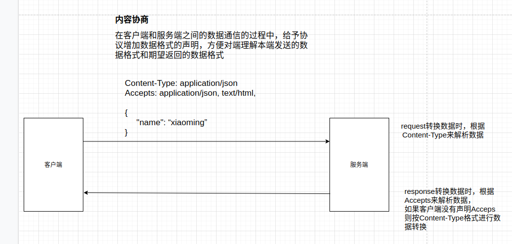

[TOC]


# 1. http请求响应

drf除了在数据序列化部分简写代码以外，还在视图中提供了简写操作。所以在django原有的django.views.View类基础上，drf封装了多个视图子类出来提供给我们使用。

Django REST framwork 提供的视图的主要作用：

- 控制序列化器的执行（检验、保存、转换数据）
- 控制数据库查询的执行
- 调用请求类和响应类[这两个类也是由drf帮我们再次扩展了一些功能类。]


为了方便我们学习，所以先创建一个子应用req

```python
python manage.py startapp req
```

注册子引用：

```python
# Application definition

INSTALLED_APPS = [
    'django.contrib.admin',
    'django.contrib.auth',
    'django.contrib.contenttypes',
    'django.contrib.sessions',
    'django.contrib.messages',
    'django.contrib.staticfiles',

    'rest_framework',

    'stuapi',    # 不使用drf编写api接口
    'students',  # 使用了drf编写api接口
    'sers',      # 演示序列化的使用
    'req',       # drf提供的http请求与响应
]

```

注册路由

```python
# 子应用路由，req/urls.py
from django.urls import path
from . import views
urlpatterns = [

]


# 总路由，drfdemo/urls.py
from django.contrib import admin
from django.urls import path, include

urlpatterns = [
    path('admin/', admin.site.urls),
    path('api/', include("stuapi.urls")),
    path('api/', include("students.urls")),
    path('sers/', include("sers.urls")),
    path("req/", include("req.urls")),
]

```


## 1.1. 请求与响应

在学drf提供的请求与响应类之前，我们需要了解一个概念：**内容协商**。

内容协商：drf在django原有的基础上，新增了一个request对象内置到了drf提供的APIVIew视图类里面，并在django原有的HttpResponse响应类的基础上实现了一个子类rest_framework.response.Response响应类。这两个类，都是基于内容协商来完成数据的格式转换的。

drf中实现的内容协商流程：

DRF的request类->parser（http请求解析类->识别客户端请求头中的Content-Type来完成数据转换成->类字典(QueryDict，字典的子类)

DRF的response类->renderer(http响应渲染类)->识别客户端请求头的"Accept"来提取客户端期望的返回数据格式-> 转换成客户端的期望格式数据



注意：django默认是没有实现内容协商的，所以我们如果希望使用内容协商，则要么手动给django提供这个功能，要么使用drf提供的视图类。


### 1.1.1 Request

REST framework 传入视图的request对象不再是Django默认的HttpRequest对象，而是REST framework提供的扩展了HttpRequest类的**Request**类的对象。

REST framework 提供了**Parser**http请求解析器类，在接收到客户端的http请求后会自动根据Content-Type指明的请求数据类型（如JSON、html表单等）将请求数据进行parse解析，解析为类字典[QueryDict]对象保存到**Request**对象中。

**Request对象的数据是自动根据前端发送数据的格式进行解析之后的结果。**也就是说，无论前端发送的哪种格式的数据，我们都可以以统一的方式读取客户端提交的数据。


#### 1.1.1.1 常用属性

##### 1）.data

`request.data` 提供了Parse解析之后的**请求体**数据。类似于Django中标准的`request.POST`和 `request.FILES`、`request.body`属性，但提供如下特性：

- 包含了解析之后的文件和非文件数据
- 包含了对POST、PUT、PATCH请求方式解析后的数据
- 利用了REST framework的parser解析器，不仅支持表单类型数据，也支持JSON数据

##### 2）.query_params

query_params，查询参数，也叫查询字符串(query string )

注意：`request.query_params`是不区分http请求方法的，只要是地址栏?号后面的查询字符串都可以接收，结果是QueryDict格式。

`request.query_params`本质上就是Django提供的`request.GET`，只是更换了更正确的名称而已。

##### 3）request._request

获取django内容的htp请求处理对象（WSGIRequest的实例对象）

#### 基本使用

视图代码：

```python


"""django的原生视图类"""
from django.views import View
from django.http.response import JsonResponse

class StudentView(View):
    def get(self,request):
        print(request)  # <WSGIRequest: GET '/req/s1'>  from django.core.handlers.wsgi import WSGIRequest
        return JsonResponse({"name":"django视图返回的xiaoming"})


"""drf提供的API视图类"""
from rest_framework.views import APIView
from rest_framework.response import Response


class StudentAPIView(APIView):
    def get(self, request):
        print(request)  # <rest_framework.request.Request: GET '/req/s2'>
        print(request._request) # <WSGIRequest: GET '/req/s2'>
        """
        从上面可以看到，APIView类中提供的request对象是drf单独声明的，但是里面提供了_request属性的值是django视图类提供的request
        """
        print(request.query_params)
        return Response({"name": "xiaoming"})

    def post(self,request):
        """request提供了data属性，基于内容协商以统一的data属性来获取客户端以任何形式提交过来的数据"""
        print(request.data)
        # 如果客户端提交的是json数据，则request.data得到的数据是一个字典   {'name': 'xiaoming', 'age': 18, 'description': 'xxxxx'}
        # 如果客户端提交的是表单数据，则request.data得到的QueryDict类字典 <QueryDict: {'name': ['xiaohong'], 'age': ['20']}>
        print(request.query_params)
        return Response({"message": "ok"})
```

路由代码：

```python
from django.urls import path
from . import views
urlpatterns = [
    path("s1", views.StudentView.as_view()),  # django
    path("s2", views.StudentAPIView.as_view()), # drf
]
```

通过postman可以测试。


### 1.1.2 Response

```
rest_framework.response.Response
```

REST framework提供了一个响应类`Response`，使用该类实例化响应对象时，响应的具体数据内容会被renderer（http响应渲染器类）转换成符合前端期望的数据类型。

REST framework提供了`Renderer` 渲染器，用来根据客户端的请求头中的`Accept`（接收数据类型声明）来自动转换响应数据到对应格式。如果前端请求中未进行声明Accept，则会采用Content-Type方式处理响应数据，我们可以通过配置来修改默认响应格式。

可以在**rest_framework/settings.py**查找所有的drf默认配置项，源码：

```python
# REST_FRAMEWORK 表示字典内部的内容是属于drf独有的配置项， 与django的配置项进行区分。
REST_FRAMEWORK = {
    'DEFAULT_RENDERER_CLASSES': (  # 默认http响应渲染类
        'rest_framework.renderers.JSONRenderer',  # json渲染器，返回json数据
        'rest_framework.renderers.BrowsableAPIRenderer',  # 浏览器API渲染器，返回api调试界面
    )
}
```

#### 1.1.2.1 构造方式

```python
Response(data, status=None, template_name=None, headers=None, content_type=None)
```

drf提供的响应处理类Response和请求处理类Request类不一样，Response就是django的HttpResponse响应处理类的子类。

`data`数据不要是render处理之后的数据，只需传递python的基本数据即可，REST framework会使用`renderer`渲染器处理`data`。

`data`不能是复杂结构的数据，如Django的模型类对象，对于这样的数据我们可以使用`Serializer`序列化器序列化处理后（转为了Python字典类型）再传递给`data`参数。

参数说明：

- `data`: 为响应准备的序列化处理后的数据；
- `status`: 状态码，默认200
- `template_name`: 模板名称，如果使用`HTMLRenderer` 时需指明；
- `headers`: 用于存放响应头信息的字典；
- `content_type`: 响应数据的Content-Type，通常此参数无需传递，REST framework会根据前端所需类型数据来设置该参数。

#### 1.1.2.2 response对象的属性

##### 1）.data

传给response对象的序列化后，但尚未render处理的数据

##### 2）.status_code

状态码的数字

##### 3）.content

经过render处理后的响应数据


#### 1.1.2.3 状态码

为了方便设置状态码，REST framewrok在`rest_framework.status`模块中提供了常用http状态码的常量。

##### 1）信息告知 - 1xx

```python
HTTP_100_CONTINUE
HTTP_101_SWITCHING_PROTOCOLS
```

##### 2）成功 - 2xx

```python
HTTP_200_OK
HTTP_201_CREATED
HTTP_202_ACCEPTED
HTTP_203_NON_AUTHORITATIVE_INFORMATION
HTTP_204_NO_CONTENT
HTTP_205_RESET_CONTENT
HTTP_206_PARTIAL_CONTENT
HTTP_207_MULTI_STATUS
```

##### 3）重定向 - 3xx

```python
HTTP_300_MULTIPLE_CHOICES
HTTP_301_MOVED_PERMANENTLY
HTTP_302_FOUND
HTTP_303_SEE_OTHER
HTTP_304_NOT_MODIFIED
HTTP_305_USE_PROXY
HTTP_306_RESERVED
HTTP_307_TEMPORARY_REDIRECT
```

##### 4）客户端错误 - 4xx

```python
HTTP_400_BAD_REQUEST
HTTP_401_UNAUTHORIZED
HTTP_402_PAYMENT_REQUIRED
HTTP_403_FORBIDDEN
HTTP_404_NOT_FOUND
HTTP_405_METHOD_NOT_ALLOWED
HTTP_406_NOT_ACCEPTABLE
HTTP_407_PROXY_AUTHENTICATION_REQUIRED
HTTP_408_REQUEST_TIMEOUT
HTTP_409_CONFLICT
HTTP_410_GONE
HTTP_411_LENGTH_REQUIRED
HTTP_412_PRECONDITION_FAILED
HTTP_413_REQUEST_ENTITY_TOO_LARGE
HTTP_414_REQUEST_URI_TOO_LONG
HTTP_415_UNSUPPORTED_MEDIA_TYPE
HTTP_416_REQUESTED_RANGE_NOT_SATISFIABLE
HTTP_417_EXPECTATION_FAILED
HTTP_422_UNPROCESSABLE_ENTITY
HTTP_423_LOCKED
HTTP_424_FAILED_DEPENDENCY
HTTP_428_PRECONDITION_REQUIRED
HTTP_429_TOO_MANY_REQUESTS
HTTP_431_REQUEST_HEADER_FIELDS_TOO_LARGE
HTTP_451_UNAVAILABLE_FOR_LEGAL_REASONS
```

##### 5）服务器错误 - 5xx

```python
HTTP_500_INTERNAL_SERVER_ERROR
HTTP_501_NOT_IMPLEMENTED
HTTP_502_BAD_GATEWAY
HTTP_503_SERVICE_UNAVAILABLE
HTTP_504_GATEWAY_TIMEOUT
HTTP_505_HTTP_VERSION_NOT_SUPPORTED
HTTP_507_INSUFFICIENT_STORAGE
HTTP_511_NETWORK_AUTHENTICATION_REQUIRED
```


为了方便演示，所以drf提供的视图里面的内容知识，我们另外创建一个子应用来展示

```bash
python manage.py startapp demo
```

注册子应用

```python
INSTALLED_APPS = [
    'django.contrib.admin',
    'django.contrib.auth',
    'django.contrib.contenttypes',
    'django.contrib.sessions',
    'django.contrib.messages',
    'django.contrib.staticfiles',
    'rest_framework',
    'students',
    'sers',    # 序列化器
    "school",  # 序列化器嵌套
    'req',     # 请求与响应
    'demo',    # 视图
]
```

总路由，代码：

```python
from django.contrib import admin
from django.urls import path, include

urlpatterns = [
    path('admin/', admin.site.urls),
    path('students/', include("students.urls")),
    path('sers/', include("sers.urls")),
    path('school/', include("school.urls")),
    path("req/", include("req.urls")),
    path("demo/", include("demo.urls")),
]
```

子应用路由，代码：

```python
from django.urls import path
from . import views

urlpatterns = [

]
```

# 1. 视图

Django REST framwork 提供的视图的主要作用：

- 控制序列化器的执行（检验、保存、转换数据）
- 控制数据库模型的操作


## 1.2 普通视图APIView

REST framework 提供了众多的通用视图基类与扩展类，以简化视图的编写。


### 1.2.1 2个视图基类

#### 1.2.1.1 APIView基本视图类

```
rest_framework.views.APIView
```

`APIView`是REST framework提供的所有视图类的基类，继承自Django的`View`父类。

`APIView`与`View`的不同之处在于：

- 传入到视图方法中的是REST framework的`Request`对象，而不是Django的`HttpRequeset`对象；

- 视图方法可以返回REST framework的`Response`对象，视图会为响应数据设置（renderer）符合前端期望要求的格式；

- 任何可以被`APIException`捕获到异常，都将会被APIView处理成合适格式的响应信息返回给客户端；

  django 的View中所有异常全部以HTML格式显示，不会返回json格式。

  drf的APIVIew或者APIView的子类会自动根据客户端的Accept进行错误信息的格式转换。

- 重新声明了一个新的as_view方法并在dispatch()进行路由分发前，会对请求的客户端进行身份认证、权限检查、流量控制。

APIView除了继承了View原有的属性方法意外，还新增了类属性：

- **authentication_classes** 值是列表或元组，成员是身份认证类
- **permissoin_classes** 值是列表或元组，成员是权限检查类
- **throttle_classes** 值是列表或元祖，成员是流量控制类

在`APIView`中仍以常规的类视图定义方法来实现get() 、post() 或者其他请求方式的方法。

为了方便演示视图学习过程中的操作，我们创建一个单独的子应用demo

```bash
python manage.py startapp demo
```

创建子路由，demo/urls.py，代码：

```python
 from django.urls import path
 from . import views

urlpatterns = [
    
]
```

把子路由注册到总路由，代码：

```python
from django.contrib import admin
from django.urls import path, include

urlpatterns = [
    path('admin/', admin.site.urls),
    path('api/', include("stuapi.urls")),
    path('api/', include("students.urls")),
    path('sers/', include("sers.urls")),
    path("req/", include("req.urls")),
    path("demo/", include("demo.urls")),
]

```


注册子应用，drfdemo/settings.py，代码：

```python
# Application definition

INSTALLED_APPS = [
    'django.contrib.admin',
    'django.contrib.auth',
    'django.contrib.contenttypes',
    'django.contrib.sessions',
    'django.contrib.messages',
    'django.contrib.staticfiles',

    'rest_framework',

    'stuapi',    # 不使用drf编写api接口
    'students',  # 使用了drf编写api接口
    'sers',      # 演示序列化的使用
    'req',       # drf提供的http请求与响应
    'demo',      # drf提供的提供的视图类
]

```


序列化器，demo/serializers.py，代码：

```python
from rest_framework import serializers
from stuapi.models import Student

class StudentModelSerializer(serializers.ModelSerializer):
    class Meta:
        model = Student
        fields = "__all__"
```

视图代码：

```python
from rest_framework import status
from rest_framework.views import APIView
from .serializers import StudentModelSerializer, Student
from rest_framework.response import Response

"""
POST /students/   添加一个学生信息
GET  /students/   获取所有学生信息

GET    /students/<pk>/  获取一个学生信息
PUT    /students/<pk>/  更新一个学生信息
DELETE /students/<pk>/  删除一个学生信息

一个路由对应一个视图类，所以我们可以把5个API分成2个类来完成
"""


class StudentAPIView(APIView):
    def get(self,request):
        """获取所有学生信息"""
        # 1. 从数据库中读取学生列表信息
        instance_list = Student.objects.all()
        # 2. 实例化序列化器，获取序列化对象
        serializer = StudentModelSerializer(instance_list, many=True)
        # 3. 使用serializer.data实现对数据进行序列化成字典
        return Response(serializer.data)

    def post(self,request):
        """添加学生信息"""
        # 1. 获取客户端提交的数据，实例化序列化器，获取序列化对象
        serializer = StudentModelSerializer(data=request.data)
        # 2. 反序列化[验证数据、保存数据到数据库]
        serializer.is_valid(raise_exception=True)
        serializer.save()
        # 3. 返回新增的模型数据经过序列化提供给客户端
        return Response(serializer.data, status=status.HTTP_201_CREATED)


class StudentInfoAPIView(APIView):
    def get(self, request, pk):
        """获取一个学生信息"""
        # 1. 使用pk作为条件获取模型对象
        instance = Student.objects.get(pk=pk)
        # 2. 实例化序列化器对象
        serializer = StudentModelSerializer(instance)
        # 3. 序列化数据并返回结果
        return Response(serializer.data)

    def put(self,request, pk):
        """更新一个学生信息"""
        # 1. 使用pk作为条件获取模型对象
        instance = Student.objects.get(pk=pk)
        # 2.获取客户端提交的数据，实例化序列化器，获取序列化对象
        serializer = StudentModelSerializer(instance, request.data)
        # 3. 反序列化[验证数据、保存数据到数据库]
        serializer.is_valid(raise_exception=True)
        serializer.save()
        # 4. 返回更新后的模型数据经过序列化提供给客户端
        return Response(serializer.data)

    def delete(self, request, pk):
        """删除一个学生信息"""
        # 1. 根据PK值获取要删除的数据并删除
        Student.objects.filter(pk=pk).delete()
        # 2. 影响删除结构
        return Response(status=status.HTTP_204_NO_CONTENT)

```

路由代码：

```python
from django.urls import path,re_path
from . import views
urlpatterns = [
    path("students/", views.StudentAPIView.as_view()),
    re_path("^students/(?P<pk>\d+)/$", views.StudentInfoAPIView.as_view()),
]
```


#### 1.2.1.2 GenericAPIView[通用视图类]

通用视图类在继承了APIView的所有功能以外，还提供了几个属性和方法让我们可以把视图中**独特的代码抽取出来作为类属性**，让视图方法中的代码变得更加通用，方便把通用代码进行简写。

```
rest_framework.generics.GenericAPIView
```

继承自`APIView`，**主要增加了操作序列化器和数据库查询的方法，作用是为下面Mixin扩展类（混入类）的执行提供方法支持。通常在使用时，可搭配一个或多个Mixin扩展类。**

提供的关于序列化器使用的1个属性与2个方法

- 属性：

  - **serializer_class=A序列化器** 指明视图使用的序列化器类

- 方法：

  - **get_serializer_class(self)**

    当出现一个视图类中调用多个序列化器时，那么可以通过条件判断在get_serializer_class方法中通过返回不同的序列化器类名就可以让视图方法执行不同的序列化器对象了。

    返回序列化器类，默认返回`serializer_class`，可以重写，例如：

    ```python
    class Student2GenericAPIView(GenericAPIView):
        # 整个视图类只使用一个序列化器的情况
        # serializer_class = StudentModelSerializert
        # 整个视图类中使用多个序列化器的情况
        def get_serializer_class(self):
          if self.request.method.lower() == "put":
                return StudentModelSerializer
          else:
                return Student2ModelSerializer
  
        queryset = Student.objects.all()
  
        def get(self, request, pk):
            """获取一个模型信息"""
            serializer = self.get_serializer(instance=self.get_object())
            return Response(serializer.data)
    
        def put(self, request, pk):
            """更新一个模型信息"""
            serializer = self.get_serializer(instance=self.get_object(), data=request.data)
            serializer.is_valid(raise_exception=True)
            serializer.save()
            return Response(serializer.data)
    ```
  
  - ##### get_serializer(self, *args, \**kwargs)
  
    返回序列化器对象，主要用来提供给Mixin扩展类使用，如果我们在视图中想要获取序列化器对象，也可以直接调用此方法。
  
    **注意，该方法在提供序列化器对象的时候，会向序列化器对象的context属性补充三个数据：request、format、view，这三个数据对象可以在序列化器内部使用。**
  
    - **request** 当前视图的请求对象
    - **view** 当前请求的类视图对象
    - format 当前请求期望返回的数据格式

提供的关于数据库查询的1个属性与2个方法

- 属性：

  - **queryset** 指明使用的数据查询的结果集

- 方法：

  - **get_queryset(self)**

    返回视图使用的查询集QuerySet，主要用来提供给Mixin扩展类使用，是列表视图与详情视图获取数据的基础，默认返回`queryset`属性，可以重写，当获取数据时需要设置一些查询条件，则可以重写如下，例如：

    ```python
    def get_queryset(self):
        user = self.request.user
        return user.course_list.all()
    ```

  - **get_object(self)**

    返回详情视图所需的1个模型类数据对象，主要用来提供给Mixin扩展类使用。

    在试图中可以调用该方法获取详情信息的模型类对象。

    **若详情访问的模型类对象不存在，会返回404异常。**

    该方法会默认使用APIView提供的check_object_permissions方法检查当前客户端是否有权限访问当前模型对象。

    举例：

    ```python
    # url(r'^books/(?P<pk>\d+)/$', views.BookDetailView.as_view()),
    class BookDetailView(GenericAPIView):
        queryset = BookInfo.objects.all()
        serializer_class = BookInfoSerializer
    
        def get(self, request, pk):
            """获取一本书的信息"""
            book = self.get_object() # get_object()方法 本质上就是 self.queryset.get(pk=pk)
            serializer = self.get_serializer(book)  # 本质上 self.serializer_class(book)
            return Response(serializer.data)
    ```

其他可以设置的属性

- **pagination_class** 指明分页控制类
- **filter_backends** 指明数据过滤控制后端，允许客户端通过地址栏传递过滤参数

视图，代码：

```python

from rest_framework.generics import GenericAPIView


"""
APIView中的api接口代码，除了部分涉及到调用模型和序列化器的代码以外，其他代码几乎都是固定写法。
所以，当我们将来针对增删查改的通用api接口编写时，完全可以基于原有的代码进行复用，
那么，drf也考虑到了这个问题，所以提供了一个GenericAPIView（通用视图类），让我们可以把接口中独特的代码单独提取出来作为类属性存在。
rest_framework.generics.GenericAPIView是APIView的子类，在APIView的基础上进行属性扩展提供了2个属性，4个方法，方便我们针对通用接口进行编写。
"""


class StudentGenericAPIView(GenericAPIView):
    queryset = Student.objects.all()
    serializer_class = StudentModelSerializer

    def get(self,request):
        """获取所有学生信息"""
        # 1. 从数据库中读取学生列表信息
        instance_list = self.get_queryset()
        # 2. 实例化序列化器，获取序列化对象
        # serializer = self.serializer_class(instance_list, many=True)
        serializer = self.get_serializer(instance_list, many=True)
        # 3. 使用serializer.data实现对数据进行序列化成字典
        return Response(serializer.data)

    def post(self,request):
        """添加学生信息"""
        # 1. 获取客户端提交的数据，实例化序列化器，获取序列化对象
        serializer = self.get_serializer(data=request.data)
        # 2. 反序列化[验证数据、保存数据到数据库]
        serializer.is_valid(raise_exception=True)
        serializer.save()
        # 3. 返回新增的模型数据经过序列化提供给客户端
        return Response(serializer.data, status=status.HTTP_201_CREATED)


class StudentInfoGenericAPIView(GenericAPIView):
    queryset = Student.objects.all()
    serializer_class = StudentModelSerializer

    def get(self, request, pk):
        """获取一个学生信息"""
        # 1. 使用pk作为条件获取模型对象
        instance = self.get_object()
        # 2. 实例化序列化器对象
        serializer = self.get_serializer(instance)
        # 3. 序列化数据并返回结果
        return Response(serializer.data)

    def put(self,request, pk):
        """更新一个学生信息"""
        # 1. 使用pk作为条件获取模型对象
        instance = self.get_object()
        # 2.获取客户端提交的数据，实例化序列化器，获取序列化对象
        serializer = self.get_serializer(instance, request.data)
        # 3. 反序列化[验证数据、保存数据到数据库]
        serializer.is_valid(raise_exception=True)
        serializer.save()
        # 4. 返回更新后的模型数据经过序列化提供给客户端
        return Response(serializer.data)

    def delete(self, request, pk):
        """删除一个学生信息"""
        # 1. 根据PK值获取要删除的数据并删除
        self.get_object().delete()
        # 2. 影响删除结构
        return Response(status=status.HTTP_204_NO_CONTENT)

```

路由代码：

```python
from django.urls import path,re_path
from . import views
urlpatterns = [
    # APIView
    path("students/", views.StudentAPIView.as_view()),
    re_path("^students/(?P<pk>\d+)/$", views.StudentInfoAPIView.as_view()),

    # GenericAPIView
    path("students1/", views.StudentGenericAPIView.as_view()),
    re_path("^students1/(?P<pk>\d+)/$", views.StudentInfoGenericAPIView.as_view()),
]
```


### 1.2.2 5个视图扩展类

也叫混入类，作用：提供了几种后端视图（对数据资源进行增删改查）处理流程的实现，如果需要编写的视图属于这五种，则视图可以通过继承相应的扩展类来复用代码，减少自己编写的代码量。

这五个扩展类需要搭配GenericAPIView通用视图基类，因为五个扩展类的实现需要调用GenericAPIView提供的序列化器与数据库查询的方法。


#### 1）ListModelMixin

列表视图扩展类，提供`list(request, *args, **kwargs)`方法快速实现列表视图，返回200状态码。

该Mixin的list方法会对数据进行过滤和分页。

源代码：

```python
class ListModelMixin(object):
    """
    List a queryset.
    """
    def list(self, request, *args, **kwargs):
        # 过滤
        queryset = self.filter_queryset(self.get_queryset())
        # 分页
        page = self.paginate_queryset(queryset)
        if page is not None:
            serializer = self.get_serializer(page, many=True)
            return self.get_paginated_response(serializer.data)
        # 序列化
        serializer = self.get_serializer(queryset, many=True)
        return Response(serializer.data)
```

举例：

```python
"""
通用视图类 + 模型扩展类 实现5个基本API接口
获取多条数据 GenericsAPIView+Mixins.ListModelMixin
"""
from rest_framework.mixins import ListModelMixin


class StudentListAPIView(GenericAPIView, ListModelMixin):
    queryset = Student.objects.all()
    serializer_class = StudentModelSerializer

    def get(self, request):
        """获取所有学生信息"""
        return self.list(request)
```


#### 2）CreateModelMixin

创建视图扩展类，提供`create(request, *args, **kwargs)`方法快速实现创建资源的视图，成功返回201状态码。

如果序列化器对前端发送的数据验证失败，返回400错误。

源代码：

```python
class CreateModelMixin(object):
    """
    Create a model instance.
    """
    def create(self, request, *args, **kwargs):
        # 获取序列化器
        serializer = self.get_serializer(data=request.data)
        # 验证
        serializer.is_valid(raise_exception=True)
        # 保存
        self.perform_create(serializer)
        headers = self.get_success_headers(serializer.data)
        return Response(serializer.data, status=status.HTTP_201_CREATED, headers=headers)

    def perform_create(self, serializer):
        serializer.save()

    def get_success_headers(self, data):
        try:
            return {'Location': str(data[api_settings.URL_FIELD_NAME])}
        except (TypeError, KeyError):
            return {}

```

视图代码：

```python
"""
通用视图类 + 模型扩展类 实现5个基本API接口
获取多条数据 GenericsAPIView+Mixins.ListModelMixin
添加一条数据 GenericsAPIView+Mixins.CreateModelMixin
"""
from rest_framework.mixins import ListModelMixin, CreateModelMixin


class StudentListAPIView(GenericAPIView, ListModelMixin, CreateModelMixin):
    queryset = Student.objects.all()
    serializer_class = StudentModelSerializer

    def get(self, request):
        """获取所有学生信息"""
        return self.list(request)

    def post(self, request):
        """添加学生信息"""
        return self.create(request)

```


#### 3）RetrieveModelMixin

详情视图扩展类，提供`retrieve(request, *args, **kwargs)`方法，可以快速实现返回一个存在的数据对象。

如果存在，返回200， 否则返回404。

源代码：

```python
class RetrieveModelMixin(object):
    """
    Retrieve a model instance.
    """
    def retrieve(self, request, *args, **kwargs):
        # 获取对象，会检查对象的权限
        instance = self.get_object()
        # 序列化
        serializer = self.get_serializer(instance)
        return Response(serializer.data)

```

视图代码：

```python
"""
获取一条数据 GenericsAPIView+Mixins.RetrieveModelMixin
"""
from rest_framework.mixins import RetrieveModelMixin

class StudentRetrieveAPIView(GenericAPIView, RetrieveModelMixin):
    queryset = Student.objects.all()
    serializer_class = StudentModelSerializer

    def get(self,request, pk):
        """获取一个学生信息"""
        return self.retrieve(request, pk)
```


#### 4）UpdateModelMixin

更新视图扩展类，提供`update(request, *args, **kwargs)`方法，可以快速实现更新一个存在的数据对象。

同时也提供`partial_update(request, *args, **kwargs)`方法，可以实现局部更新。

成功返回200，序列化器校验数据失败时，返回400错误。

源代码：

```python
class UpdateModelMixin(object):
    """
    Update a model instance.
    """
    def update(self, request, *args, **kwargs):
        partial = kwargs.pop('partial', False)
        instance = self.get_object()
        serializer = self.get_serializer(instance, data=request.data, partial=partial)
        serializer.is_valid(raise_exception=True)
        self.perform_update(serializer)

        if getattr(instance, '_prefetched_objects_cache', None):
            # If 'prefetch_related' has been applied to a queryset, we need to
            # forcibly invalidate the prefetch cache on the instance.
            instance._prefetched_objects_cache = {}

        return Response(serializer.data)

    def perform_update(self, serializer):
        serializer.save()

    def partial_update(self, request, *args, **kwargs):
        kwargs['partial'] = True
        return self.update(request, *args, **kwargs)

```

视图代码：

```python
from rest_framework.mixins import RetrieveModelMixin,UpdateModelMixin

"""
获取一条数据 GenericsAPIView+Mixins.RetrieveModelMixin
更新一条数据 GenericsAPIView+Mixins.UpdateModelMixin
删除一条数据 GenericsAPIView+Mixins.DestroyModelMixin
"""

class StudentRetrieveAPIView(GenericAPIView, RetrieveModelMixin, UpdateModelMixin):
    queryset = Student.objects.all()
    serializer_class = StudentModelSerializer

    def get(self,request, pk):
        """获取一个学生信息"""
        return self.retrieve(request, pk)

    def put(self,request, pk):
        """更新一个学生信息"""
        return self.update(request, pk)

```


#### 5）DestroyModelMixin

删除视图扩展类，提供`destroy(request, *args, **kwargs)`方法，可以快速实现删除一个存在的数据对象。

成功返回204，不存在返回404。

源代码：

```python
class DestroyModelMixin(object):
    """
    Destroy a model instance.
    """
    def destroy(self, request, *args, **kwargs):
        instance = self.get_object()
        self.perform_destroy(instance)
        return Response(status=status.HTTP_204_NO_CONTENT)

    def perform_destroy(self, instance):
        instance.delete()

```

视图代码：

```python
"""
获取一条数据 GenericsAPIView+Mixins.RetrieveModelMixin
更新一条数据 GenericsAPIView+Mixins.UpdateModelMixin
删除一条数据 GenericsAPIView+Mixins.DestroyModelMixin
"""

from rest_framework.mixins import RetrieveModelMixin,  UpdateModelMixin, DestroyModelMixin


class StudentRetrieveAPIView(GenericAPIView, RetrieveModelMixin, UpdateModelMixin, DestroyModelMixin):
    queryset = Student.objects.all()
    serializer_class = StudentModelSerializer

    def get(self,request, pk):
        """获取一个学生信息"""
        return self.retrieve(request, pk)

    def put(self,request, pk):
        """更新一个学生信息"""
        return self.update(request, pk)

    def delete(self,request, pk):
        """删除一个学生信息"""
        return self.destroy(request, pk)

```

整体代码，使用GenericAPIView结合视图扩展类，实现5个基本api接口，视图代码：

```python
"""
通用视图类 + 模型扩展类 实现5个基本API接口
获取多条数据 GenericsAPIView+Mixins.ListModelMixin
添加一条数据 GenericsAPIView+Mixins.CreateModelMixin
"""
from rest_framework.mixins import ListModelMixin, CreateModelMixin, RetrieveModelMixin, \
    UpdateModelMixin, DestroyModelMixin


class StudentListAPIView(GenericAPIView, ListModelMixin, CreateModelMixin):
    queryset = Student.objects.all()
    serializer_class = StudentModelSerializer

    def get(self, request):
        """获取所有学生信息"""
        return self.list(request)

    def post(self, request):
        """添加学生信息"""
        return self.create(request)

"""
获取一条数据 GenericsAPIView+Mixins.RetrieveModelMixin
更新一条数据 GenericsAPIView+Mixins.UpdateModelMixin
删除一条数据 GenericsAPIView+Mixins.DestroyModelMixin
"""

class StudentRetrieveAPIView(GenericAPIView, RetrieveModelMixin, UpdateModelMixin, DestroyModelMixin):
    queryset = Student.objects.all()
    serializer_class = StudentModelSerializer

    def get(self,request, pk):
        """获取一个学生信息"""
        return self.retrieve(request, pk)

    def put(self,request, pk):
        """更新一个学生信息"""
        return self.update(request, pk)

    def delete(self,request, pk):
        """删除一个学生信息"""
        return self.destroy(request, pk)

```

路由代码：

```python
from django.urls import path,re_path
from . import views
urlpatterns = [
    # APIView
    path("students/", views.StudentAPIView.as_view()),
    re_path("^students/(?P<pk>\d+)/$", views.StudentInfoAPIView.as_view()),

    # GenericAPIView
    path("students1/", views.StudentGenericAPIView.as_view()),
    re_path("^students1/(?P<pk>\d+)/$", views.StudentInfoGenericAPIView.as_view()),

    # GenericAPIView + Mixins
    path("students2/", views.StudentListAPIView.as_view()),
    re_path("^students2/(?P<pk>\d+)/$", views.StudentRetrieveAPIView.as_view()),
]
```


### 1.2.3 9个视图子类

#### 1）ListAPIView

提供了get视图方法，内部调用了模型扩展类的list方法

继承自：GenericAPIView、ListModelMixin

#### 2）CreateAPIView

提供了post视图方法，内部调用了模型扩展类的create方法

继承自： GenericAPIView、CreateModelMixin

#### 3）RetrieveAPIView

提供了get视图方法，内部调用了模型扩展类的retrieve方法

继承自: GenericAPIView、RetrieveModelMixin

#### 4）DestroyAPIView

提供了delete视图方法，内部调用了模型扩展类的destroy方法

继承自：GenericAPIView、DestoryModelMixin

#### 5）UpdateAPIView

提供了put和patch视图方法，内部调用了模型扩展类的update和partial_update方法

继承自：GenericAPIView、UpdateModelMixin

#### 6）ListCreateAPIView

提供了get和post方法，内部调用了list和create方法

继承自：GenericAPIView、ListModelMixin、CreateModelMixin

#### 7）RetrieveUpdateAPIView

提供 get、put、patch方法

继承自： GenericAPIView、RetrieveModelMixin、UpdateModelMixin

#### 8）RetrieveDestroyAPIView

提供 get、delete方法

继承自：GenericAPIView、RetrieveModelMixin、DestroyModelMixin

#### 9）RetrieveUpdateDestroyAPIView

提供 get、put、patch、delete方法

继承自：GenericAPIView、RetrieveModelMixin、UpdateModelMixin、DestroyModelMixin

视图代码：

```python
"""
上面的接口代码还可以继续更加的精简，drf在使用GenericAPIView和Mixins进行组合以后，还提供了视图子类。
视图子类是通用视图类 和 模型扩展类 的子类，提供了各种的视图方法调用mixins操作
    ListAPIView = GenericAPIView + ListModelMixin                 获取多条数据的视图方法
    CreateAPIView = GenericAPIView + CreateModelMixin       添加一条数据的视图方法
    RetrieveAPIView = GenericAPIView + RetrieveModelMixin  获取一条数据的视图方法
    UpdateAPIView = GenericAPIView + UpdateModelMixin     更新一条数据的视图方法
    DestroyAPIView = GenericAPIView + DestroyModelMixin    删除一条数据的视图方法

组合视图子类
    ListCreateAPIView = ListAPIView + CreateAPIView
    RetrieveUpdateAPIView = RetrieveAPIView + UpdateAPIView
    RetrieveDestroyAPIView = RetrieveAPIView + DestroyAPIView
    RetrieveUpdateDestroyAPIView = RetrieveAPIView + UpdateAPIView + DestroyAPIView
"""

from rest_framework.generics import ListAPIView, CreateAPIView, \
    RetrieveAPIView, UpdateAPIView, DestroyAPIView, \
    ListCreateAPIView, RetrieveUpdateAPIView, RetrieveDestroyAPIView, RetrieveUpdateDestroyAPIView


# class StuListAPIView(ListAPIView, CreateAPIView):
class StuListAPIView(ListCreateAPIView):
    queryset = Student.objects.all()
    serializer_class = StudentModelSerializer


# class StuRetrieveAPIView(RetrieveAPIView, UpdateAPIView, DestroyAPIView):
# class StuRetrieveAPIView(RetrieveUpdateAPIView, DestroyAPIView):
# class StuRetrieveAPIView(RetrieveDestroyAPIView, UpdateAPIView):
class StuRetrieveAPIView(RetrieveUpdateDestroyAPIView):
    queryset = Student.objects.all()
    serializer_class = StudentModelSerializer

```

路由，代码：

```python
from django.urls import path,re_path
from . import views
urlpatterns = [
    # APIView
    path("students/", views.StudentAPIView.as_view()),
    re_path("^students/(?P<pk>\d+)/$", views.StudentInfoAPIView.as_view()),

    # GenericAPIView
    path("students1/", views.StudentGenericAPIView.as_view()),
    re_path("^students1/(?P<pk>\d+)/$", views.StudentInfoGenericAPIView.as_view()),

    # GenericAPIView + Mixins
    path("students2/", views.StudentListAPIView.as_view()),
    re_path("^students2/(?P<pk>\d+)/$", views.StudentRetrieveAPIView.as_view()),

    # 视图子类
    path("students3/", views.StuListAPIView.as_view()),
    re_path("^students3/(?P<pk>\d+)/$", views.StuRetrieveAPIView.as_view()),
]
```


## 1.3 视图集ViewSet

使用视图集ViewSet，可以将一系列视图相关的代码逻辑和相关的http请求动作封装到一个类中：

- list() 提供一组数据
- retrieve() 提供单个数据
- create() 创建数据
- update() 保存数据
- destory() 删除数据

ViewSet视图集类不再限制视图方法名为get/post...等这种情况了，而是实现允许开发者根据自己的需要定义自定义视图方法名，例如  list() 或get_all()、create() 等，然后经过路由中使用http请求动作和这些视图方法名action进行绑定映射调用。

视图集在使用as_view()方法时，设置字典参数允许我们将代表视图方法名与具体http请求进行绑定。

### 1.3.1 常用视图集父类

#### 1） ViewSet

继承自`APIView`与`ViewSetMixin`，作用也与APIView基本类似，提供了身份认证、权限校验、流量管理等。

**ViewSet主要通过继承ViewSetMixin来实现在调用as_view()时传入字典{“http请求”：“视图方法”}的映射处理工作，如{'get':'list'}，**

在ViewSet中，没有提供任何动作action方法，需要我们自己实现action方法。


```python
"""
上面代码如果想要合并成一个视图类，实现一个视图类提供5个甚至更多的API接口，则需要继承视图集（ViewSet）
为什么要继承视图集（ViewSet）？
1. 上面使用的视图类都是基于APIView实现的，而APIView基于django提供的View视图基类，
   而django的视图类View在内部实现时，dispatch方法中限制了当前视图必须采用get/post/put/delete/patch等http请求动作作为方法名，但是
   如果要实现5个api接口，必然要实现2个get请求，分别是获取多条数据与获取一条数据，一个类中肯定不存在同名的方法。
   
2. 5个接口api接口中，只有删除、获取、更新一条数据时需要地址栏传递ID，而添加一条数据与获取多条数据，实际上并不需要ID。
   所以，路由有决定我们要分开写5个接口。

drf为了解决上面的2个问题，提供了视图集和路由集。
视图集就可以帮我们实现一个视图类响应多种重复的http请求
路由集就可以帮我们实现自动根据不同的视图方法来生成不同参数的路由地址。
from rest_framework.viewsets import ViewSet  # ViewSet是APIView的子类，是所有drf中的视图集的父类
"""


"""使用ViewSet基本视图集实现5个基本api接口"""
from rest_framework.viewsets import ViewSet


class StudentViewSet(ViewSet):
    def list(self,request):
        """获取多个数据"""
        # 1. 从数据库中读取模型列表信息
        instance_list = Student.objects.all()
        # 2. 实例化序列化器，获取序列化对象
        serializer = StudentModelSerializer(instance_list, many=True)
        # 3. 使用serializer.data实现对数据进行序列化成字典
        return Response(serializer.data)

    def create(self, request):
        """添加数据"""
        # 1. 获取客户端提交的数据，实例化序列化器，获取序列化对象
        serializer = StudentModelSerializer(data=request.data)
        # 2. 反序列化[验证数据、保存数据到数据库]
        serializer.is_valid(raise_exception=True)
        serializer.save()
        # 3. 返回新增的模型数据经过序列化提供给客户端
        return Response(serializer.data, status=status.HTTP_201_CREATED)

    def retrieve(self, request, pk):
        """获取一个学生信息"""
        # 1. 使用pk作为条件获取模型对象
        instance = Student.objects.get(pk=pk)
        # 2. 实例化序列化器对象
        serializer = StudentModelSerializer(instance)
        # 3. 序列化数据并返回结果
        return Response(serializer.data)

    def update(self,request, pk):
        """更新一个学生信息"""
        # 1. 使用pk作为条件获取模型对象
        instance = Student.objects.get(pk=pk)
        # 2.获取客户端提交的数据，实例化序列化器，获取序列化对象
        serializer = StudentModelSerializer(instance, request.data)
        # 3. 反序列化[验证数据、保存数据到数据库]
        serializer.is_valid(raise_exception=True)
        serializer.save()
        # 4. 返回更新后的模型数据经过序列化提供给客户端
        return Response(serializer.data)

    def destroy(self, request, pk):
        """删除一个学生信息"""
        # 1. 根据PK值获取要删除的数据并删除
        Student.objects.filter(pk=pk).delete()
        # 2. 影响删除结构
        return Response(status=status.HTTP_204_NO_CONTENT)

```

在设置路由时，我们可以如下操作

```python
from django.urls import path,re_path
from . import views
urlpatterns = [
    # 代码省略。。。。。。
    # 代码省略。。。。。。
    
    
    # ViewSet
    # 视图集的路由注册格式
    # path("访问路径", views.视图集类名.as_view({"http请求方法名": "视图方法名", "http请求方法名": "视图方法名", ...})),
    path("students4/", views.StudentViewSet.as_view({"get": "list", "post": "create"})),
    re_path("^students4/(?P<pk>\d+)/$", views.StudentViewSet.as_view({
        "get": "retrieve",
        "put": "update",
        "delete": "destroy",
    })),
]
```


#### 2）GenericViewSet

继承自GenericAPIView和ViewSetMixin，作用让视图集的视图代码变得更加通用，抽离独特代码作为视图类的属性。

使用ViewSet通常并不方便，因为list、retrieve、create、update、destory等方法都需要自己编写，而这些方法与前面讲过的Mixin扩展类提供的方法同名，所以我们可以通过继承Mixin扩展类来复用这些方法而无需自己编写。但是Mixin扩展类依赖与`GenericAPIView`，所以还需要继承`GenericAPIView`。

**GenericViewSet**就帮助我们完成了这样的继承工作，继承自`GenericAPIView`与`ViewSetMixin`，在实现了调用as_view()时传入字典（如`{'get':'list'}`）的映射处理工作的同时，还提供了`GenericAPIView`提供的基础方法，可以直接搭配Mixin扩展类使用。

视图代码：

```python

"""
使用通用视图集类GenericViewSet实现接口中独特代码的分离
"""
from rest_framework.viewsets import GenericViewSet


class StudentGenericViewSet(GenericViewSet):
    queryset = Student.objects.all()
    serializer_class = StudentModelSerializer

    def list(self,request):
        """获取多个数据"""
        # 1. 从数据库中读取模型列表信息
        instance_list = self.get_queryset()
        # 2. 实例化序列化器，获取序列化对象
        serializer = self.get_serializer(instance_list, many=True)
        # 3. 使用serializer.data实现对数据进行序列化成字典
        return Response(serializer.data)

    def create(self, request):
        """添加数据"""
        # 1. 获取客户端提交的数据，实例化序列化器，获取序列化对象
        serializer = self.get_serializer(data=request.data)
        # 2. 反序列化[验证数据、保存数据到数据库]
        serializer.is_valid(raise_exception=True)
        serializer.save()
        # 3. 返回新增的模型数据经过序列化提供给客户端
        return Response(serializer.data, status=status.HTTP_201_CREATED)

    def retrieve(self, request, pk):
        """获取一个数据"""
        # 1. 使用pk作为条件获取模型对象
        instance = self.get_object()
        # 2. 实例化序列化器对象
        serializer = self.get_serializer(instance)
        # 3. 序列化数据并返回结果
        return Response(serializer.data)

    def update(self,request, pk):
        """更新一个数据"""
        # 1. 使用pk作为条件获取模型对象
        instance = self.get_object()
        # 2.获取客户端提交的数据，实例化序列化器，获取序列化对象
        serializer = self.get_serializer(instance, request.data)
        # 3. 反序列化[验证数据、保存数据到数据库]
        serializer.is_valid(raise_exception=True)
        serializer.save()
        # 4. 返回更新后的模型数据经过序列化提供给客户端
        return Response(serializer.data)

    def destroy(self, request, pk):
        """删除一个数据"""
        # 1. 根据PK值获取要删除的数据并删除
        self.get_object().delete()
        # 2. 影响删除结构
        return Response(status=status.HTTP_204_NO_CONTENT)
```

路由代码：

```python
from django.urls import path,re_path
from . import views
urlpatterns = [
    # APIView
    path("students/", views.StudentAPIView.as_view()),
    re_path("^students/(?P<pk>\d+)/$", views.StudentInfoAPIView.as_view()),

    # GenericAPIView
    path("students1/", views.StudentGenericAPIView.as_view()),
    re_path("^students1/(?P<pk>\d+)/$", views.StudentInfoGenericAPIView.as_view()),

    # GenericAPIView + Mixins
    path("students2/", views.StudentListAPIView.as_view()),
    re_path("^students2/(?P<pk>\d+)/$", views.StudentRetrieveAPIView.as_view()),

    # 视图子类
    path("students3/", views.StuListAPIView.as_view()),
    re_path("^students3/(?P<pk>\d+)/$", views.StuRetrieveAPIView.as_view()),

    # ViewSet
    # 视图集的路由注册格式
    # path("访问路径", views.视图集类名.as_view({"http请求方法名": "视图方法名", "http请求方法名": "视图方法名", ...})),
    path("students4/", views.StudentViewSet.as_view({"get": "list", "post": "create"})),
    re_path("^students4/(?P<pk>\d+)/$", views.StudentViewSet.as_view({
        "get": "retrieve",
        "put": "update",
        "delete": "destroy",
    })),

    # GenericViewSet
    path("students5/", views.StudentGenericViewSet.as_view({"get": "list", "post": "create"})),
    re_path("^students5/(?P<pk>\d+)/$", views.StudentGenericViewSet.as_view({
        "get": "retrieve",
        "put": "update",
        "delete": "destroy",
    })),
]
```

结合我们上面学习的模型扩展类，实现简写操作，视图代码：

```python

"""
使用通用视图集类+模型扩展类，直接达到简写api代码的目的
"""

class StudentGenViewSet(GenericViewSet,
                        ListModelMixin,
                        CreateModelMixin,
                        RetrieveModelMixin,
                        UpdateModelMixin,
                        DestroyModelMixin
                        ):
    queryset = Student.objects.all()
    serializer_class = StudentModelSerializer

```

路由，代码：

```python
from django.urls import path,re_path
from . import views
urlpatterns = [
    # APIView
    path("students/", views.StudentAPIView.as_view()),
    re_path("^students/(?P<pk>\d+)/$", views.StudentInfoAPIView.as_view()),

    # GenericAPIView
    path("students1/", views.StudentGenericAPIView.as_view()),
    re_path("^students1/(?P<pk>\d+)/$", views.StudentInfoGenericAPIView.as_view()),

    # GenericAPIView + Mixins
    path("students2/", views.StudentListAPIView.as_view()),
    re_path("^students2/(?P<pk>\d+)/$", views.StudentRetrieveAPIView.as_view()),

    # 视图子类
    path("students3/", views.StuListAPIView.as_view()),
    re_path("^students3/(?P<pk>\d+)/$", views.StuRetrieveAPIView.as_view()),

    # ViewSet
    # 视图集的路由注册格式
    # path("访问路径", views.视图集类名.as_view({"http请求方法名": "视图方法名", "http请求方法名": "视图方法名", ...})),
    path("students4/", views.StudentViewSet.as_view({"get": "list", "post": "create"})),
    re_path("^students4/(?P<pk>\d+)/$", views.StudentViewSet.as_view({
        "get": "retrieve",
        "put": "update",
        "delete": "destroy",
    })),

    # GenericViewSet
    path("students5/", views.StudentGenericViewSet.as_view({"get": "list", "post": "create"})),
    re_path("^students5/(?P<pk>\d+)/$", views.StudentGenericViewSet.as_view({
        "get": "retrieve",
        "put": "update",
        "delete": "destroy",
    })),

    # GenericViewSet + 模型扩展类
    path("students6/", views.StudentGenViewSet.as_view({"get": "list", "post": "create"})),
    re_path("^students6/(?P<pk>\d+)/$", views.StudentGenViewSet.as_view({
        "get": "retrieve",
        "put": "update",
        "delete": "destroy",
    })),
]
```


#### 3）ModelViewSet

继承自`GenericViewSet`，同时包括了ListModelMixin、RetrieveModelMixin、CreateModelMixin、UpdateModelMixin、DestoryModelMixin。

视图代码：

```python

"""
ModelViewSet = GenericViewSet + ListModelMixin + CreateModelMixin+
               RetrieveModelMixin + UpdateModelMixin + DestroyModelMixin
"""
from rest_framework.viewsets import ModelViewSet
class StudentModelViewSet(ModelViewSet):
    queryset = Student.objects.all()
    serializer_class = StudentModelSerializer

```

路由代码：

```python
from django.urls import path,re_path
from . import views
urlpatterns = [
    # APIView
    path("students/", views.StudentAPIView.as_view()),
    re_path("^students/(?P<pk>\d+)/$", views.StudentInfoAPIView.as_view()),

    # GenericAPIView
    path("students1/", views.StudentGenericAPIView.as_view()),
    re_path("^students1/(?P<pk>\d+)/$", views.StudentInfoGenericAPIView.as_view()),

    # GenericAPIView + Mixins
    path("students2/", views.StudentListAPIView.as_view()),
    re_path("^students2/(?P<pk>\d+)/$", views.StudentRetrieveAPIView.as_view()),

    # 视图子类
    path("students3/", views.StuListAPIView.as_view()),
    re_path("^students3/(?P<pk>\d+)/$", views.StuRetrieveAPIView.as_view()),

    # ViewSet
    # 视图集的路由注册格式
    # path("访问路径", views.视图集类名.as_view({"http请求方法名": "视图方法名", "http请求方法名": "视图方法名", ...})),
    path("students4/", views.StudentViewSet.as_view({"get": "list", "post": "create"})),
    re_path("^students4/(?P<pk>\d+)/$", views.StudentViewSet.as_view({
        "get": "retrieve",
        "put": "update",
        "delete": "destroy",
    })),

    # GenericViewSet
    path("students5/", views.StudentGenericViewSet.as_view({"get": "list", "post": "create"})),
    re_path("^students5/(?P<pk>\d+)/$", views.StudentGenericViewSet.as_view({
        "get": "retrieve",
        "put": "update",
        "delete": "destroy",
    })),

    # GenericViewSet + 模型扩展类
    path("students6/", views.StudentGenViewSet.as_view({"get": "list", "post": "create"})),
    re_path("^students6/(?P<pk>\d+)/$", views.StudentGenViewSet.as_view({
        "get": "retrieve",
        "put": "update",
        "delete": "destroy",
    })),

    # ModelViewSet 模型视图集
    path("students7/", views.StudentModelViewSet.as_view({"get": "list", "post": "create"})),
    re_path("^students7/(?P<pk>\d+)/$", views.StudentModelViewSet.as_view({
        "get": "retrieve",
        "put": "update",
        "delete": "destroy",
    })),
]
```


#### 4）ReadOnlyModelViewSet

继承自`GenericViewSet`，同时包括了ListModelMixin、RetrieveModelMixin。

视图代码：

```python
"""
ReadOnlyModelViewSet = RetrieveModelMixin + ListModelMixin + GenericViewSet
"""
from rest_framework.viewsets import ReadOnlyModelViewSet


class StudentReadOnlyModelViewSet(ReadOnlyModelViewSet):
    queryset = Student.objects.all()
    serializer_class = StudentModelSerializer

```

路由代码：

```python
from django.urls import path,re_path
from . import views
urlpatterns = [
    # APIView
    path("students/", views.StudentAPIView.as_view()),
    re_path("^students/(?P<pk>\d+)/$", views.StudentInfoAPIView.as_view()),

    # GenericAPIView
    path("students1/", views.StudentGenericAPIView.as_view()),
    re_path("^students1/(?P<pk>\d+)/$", views.StudentInfoGenericAPIView.as_view()),

    # GenericAPIView + Mixins
    path("students2/", views.StudentListAPIView.as_view()),
    re_path("^students2/(?P<pk>\d+)/$", views.StudentRetrieveAPIView.as_view()),

    # 视图子类
    path("students3/", views.StuListAPIView.as_view()),
    re_path("^students3/(?P<pk>\d+)/$", views.StuRetrieveAPIView.as_view()),

    # ViewSet
    # 视图集的路由注册格式
    # path("访问路径", views.视图集类名.as_view({"http请求方法名": "视图方法名", "http请求方法名": "视图方法名", ...})),
    path("students4/", views.StudentViewSet.as_view({"get": "list", "post": "create"})),
    re_path("^students4/(?P<pk>\d+)/$", views.StudentViewSet.as_view({
        "get": "retrieve",
        "put": "update",
        "delete": "destroy",
    })),

    # GenericViewSet
    path("students5/", views.StudentGenericViewSet.as_view({"get": "list", "post": "create"})),
    re_path("^students5/(?P<pk>\d+)/$", views.StudentGenericViewSet.as_view({
        "get": "retrieve",
        "put": "update",
        "delete": "destroy",
    })),

    # GenericViewSet + 模型扩展类
    path("students6/", views.StudentGenViewSet.as_view({"get": "list", "post": "create"})),
    re_path("^students6/(?P<pk>\d+)/$", views.StudentGenViewSet.as_view({
        "get": "retrieve",
        "put": "update",
        "delete": "destroy",
    })),

    # ModelViewSet 模型视图集
    path("students7/", views.StudentModelViewSet.as_view({"get": "list", "post": "create"})),
    re_path("^students7/(?P<pk>\d+)/$", views.StudentModelViewSet.as_view({
        "get": "retrieve",
        "put": "update",
        "delete": "destroy",
    })),

    # ReadOnlyModelViewSet  只读视图集
    path("students8/", views.StudentReadOnlyModelViewSet.as_view({"get": "list"})),
    re_path("^students8/(?P<pk>\d+)/$", views.StudentReadOnlyModelViewSet.as_view({"get": "retrieve"})),
]
```

# 2. 路由集Routers

对于视图集ViewSet，我们除了可以自己手动指明请求方式与视图方法之间的对应关系外，还可以使用Routers来帮助我们快速实现路由信息。如果是非视图集，不需要使用路由集routers。

REST framework提供了两个router类，使用方式一致的。结果多一个或少一个根目录url地址的问题而已。

- **SimpleRouter**   线上运营项目
- **DefaultRouter**  本地开发，项目上线前

## 2.1 使用方法

1） 创建router对象，并注册视图集。

demo/urls.py，代码：

```python
"""使用路由集给视图集生成url路由"""
from rest_framework.routers import DefaultRouter, SimpleRouter

# 实例化路由对象
router = SimpleRouter()
# 注册视图集[每次注册一个视图集类，就需要调用register]
router.register("students9", views.StuModelViewSet, basename="student9")
router.register("students10", views.StuModelViewSet, basename="students10")

# 所有被注册的实体集生成的路由信息，全部会被集中到router.urls路由列表中，所以我们要把urls拼接到urlpatterns
urlpatterns += router.urls

```

register(prefix, viewset, basename)

- prefix 该视图集的路由前缀
- viewset 视图集
- basename 路由别名的前缀

如上述代码会形成的路由如下：

```python
url: ^students9/$                             basename: students9-list
url: ^students9/(?P<pk>[^/.]+)/$   basename: students9-detail
```

2）把路由对象生成的视图集的路由列表添加到django的路由中可以有两种方式：

```python
urlpatterns = [
    ...
]

urlpatterns += router.urls
```

或

```python
from django.urls import include,re_path
urlpatterns = [
    ...
    path("", include(router.urls))
]
```


## 2.2 视图集中附加action的声明

在视图集中，如果想要让Router自动帮助我们为自定义视图方法生成对应路由信息，需要使用`rest_framework.decorators.action`装饰器。action装饰器可以让开发者在视图中绑定要路由集生成的url地址

action装饰器可以接收两个参数：

- **methods**: 声明该action对应的请求方式，列表参数

- **detail**: 声明该action的路径是否为单一资源，也就是使用生成附带pk值的url路径
- True 表示路径格式是`<prefix>/<pk>/<url_path>/`
  - False 表示路径格式是`<prefix>/<url_path>/`
  
- url_path：声明该action的路由尾缀。默认就是视图方法名

举例：

```python
from rest_framework.viewsets import ModelViewSet
from rest_framework.decorators import action


class StuModelViewSet(ModelViewSet):
    queryset = Student.objects.all()
    serializer_class = StudentModelSerializer

    # @action(methods=["GET", "POST"], detail=False, url_path="abc")
    @action(methods=["GET", "POST"], detail=False)
    def login(self, request):
        print(self.action)  # 获取当前视图方法名
        return Response("用户登录")

    @action(methods=["GET"], detail=True)
    def logout(self,request, pk):  # 当action装饰的参数detail值为True时，表示当前视图必须接收一个pk参数
        return Response("注销登录")

```

由路由器自动为此视图集自定义action方法形成的路由会是如下内容：

```python
url: ^students9/login/$                                   basename: students9-login
url: ^students9/(?P<pk>[^/.]+)/logout/$       basename: students9-logout
```


## 2.3 路由router形成URL的方式

1） SimpleRouter(prefix="路由前缀"，viewset=视图集类，basename="路由别名")


2）DefaultRouter


DefaultRouter与SimpleRouter的区别是，DefaultRouter会多附带一个默认的API根视图，返回一个包含所有列表视图的超链接响应数据。

