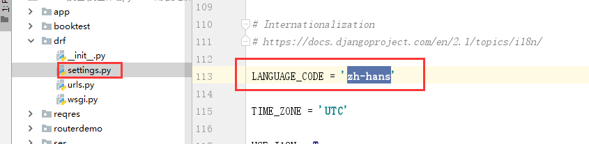

[TOC]


为了方便接下来的学习，我们创建一个新的子应用 component

```python
python manage.py startapp component
```

component/urls.py，子路由代码：

```python
from django.urls import path
from . import views

urlpatterns = [
    
]
```

注册子应用，settings.py，代码：

```python
# Application definition

INSTALLED_APPS = [
    'django.contrib.admin',
    'django.contrib.auth',
    'django.contrib.contenttypes',
    'django.contrib.sessions',
    'django.contrib.messages',
    'django.contrib.staticfiles',

    'rest_framework',

    'stuapi',    # 不使用drf编写api接口
    'students',  # 使用了drf编写api接口
    'sers',      # 演示序列化的使用
    'req',       # drf提供的http请求与响应
    'demo',      # drf提供的提供的视图类
    'component', # drf提供的组件功能
]

```

总路由，代码：

```python
from django.contrib import admin
from django.urls import path, include

urlpatterns = [
    path('admin/', admin.site.urls),
    path('api/', include("stuapi.urls")),
    path('api/', include("students.urls")),
    path('sers/', include("sers.urls")),
    path("req/", include("req.urls")),
    path("demo/", include("demo.urls")),
    path("component/", include("component.urls")),
]

```

因为接下来的认证组件中需要使用到登陆功能，所以我们使用django内置admin站点并创建一个管理员.

admin运营站点的访问地址：http://127.0.0.1:8000/admin

```shell
python manage.py createsuperuser
# 如果之前有账号，但是忘了，可以通过终端下的命令修改指定用户的密码，这里的密码必须8位长度以上的
python manage.py changepassword 用户名
```


创建管理员以后，访问admin站点，先修改站点的语言配置

settings.py

```
LANGUAGE_CODE = 'zh-hans'

TIME_ZONE = 'Asia/Shanghai'
```



访问admin 站点效果：


# 1. 认证Authentication

可以在配置文件中配置全局默认的认证方式/认证方案。

开发中常见的认证方式：cookie、**session**、**token**

rest_framework/settings.py 默认配置文件

```python
REST_FRAMEWORK = {
    # 配置认证方式的选项
    'DEFAULT_AUTHENTICATION_CLASSES': (
        'rest_framework.authentication.SessionAuthentication', # session认证
        'rest_framework.authentication.BasicAuthentication',   # basic认证[基于账号密码]
    )
}
```

可以在具体的视图类中通过设置类属性authentication_classess来设置单独的不同的认证方式

```python
from rest_framework.views import APIView
from rest_framework.response import Response
from rest_framework.authentication import SessionAuthentication, BasicAuthentication

# Create your views here.
class AuthenticationAPIView(APIView):
    # 局部的认证方式，支持多个认证方法
    authentication_classes = [SessionAuthentication]
    def get(self,request):
        print(request.user)
        # AnonymousUser 就是在request.user无法识别当前访问的客户端时的游客用户对象
        return Response("ok")
```

认证失败会有两种可能的返回值，这个需要我们配合权限组件来使用：

- 401 Unauthorized 未认证
- 403 Permission Denied 权限被禁止

自定义认证，`component/authentication.py`，代码：

```python
from rest_framework.authentication import BaseAuthentication
from django.contrib.auth import get_user_model  # 自动识别当前django系统中的系统用户模型


class CustomAuthentication(BaseAuthentication):
    """
    自定义认证方式
    """
    def authenticate(self, request):
        """核心认证方法"""
        user = request.query_params.get("user")
        pwd = request.query_params.get("pwd")
        if user != "root" or pwd != "houmen":
            return None

        # get_user_model获取当前系统中用户表对应的用户模型类
        user = get_user_model().objects.filter(is_superuser=1, is_active=1).first()
        return (user, None)  # 按照固定的返回格式填写 （用户模型对象, None）

```

视图调用自定义认证，视图代码：

```python
from rest_framework.views import APIView
from rest_framework.response import Response
from rest_framework.authentication import SessionAuthentication, BasicAuthentication
from .authentication import CustomAuthentication

# Create your views here.
class AuthenticationAPIView(APIView):
    # 局部的认证方式，支持多个认证方法
    authentication_classes = [CustomAuthentication]
    def get(self,request):
        print(request.user)
        # AnonymousUser 就是在request.user无法识别当前访问的客户端时的游客用户对象
        return Response("ok")

```

当然也可以注释掉上面视图中的配置，改成全局配置。settings.py，代码：

```python
"""drf配置信息必须全部写在REST_FRAMEWORK配置项中"""
REST_FRAMEWORK = {
    # 配置认证方式的选项【drf的认证是内部循环遍历每一个注册的认证类，一旦认证通过识别到用户身份，则不会继续循环】
    'DEFAULT_AUTHENTICATION_CLASSES': (
        'drfdemo.authentication.CustomAuthentication',            # 自定义认证
        'rest_framework.authentication.SessionAuthentication',  # session认证
        'rest_framework.authentication.BasicAuthentication',      # 基本认证
    )
}
```

# 2. 权限Permissions

权限控制可以限制用户对于视图的访问和对于具有模型对象的访问。

- 在APIView视图的dispatch()方法中调用initial方法中先进行视图访问权限的判断

  `self.check_permissions(request)`

- 在GenericAPIView通过get_object()获取具体模型对象时，会进行模型对象访问权限的判断

  `self.check_object_permissions(self.request, obj)`

## 使用

可以在配置文件restframework/settings.py中默认的**全局设置**了权限管理类，源码：

```python
REST_FRAMEWORK = {
    ....
    'DEFAULT_PERMISSION_CLASSES': [
        'rest_framework.permissions.AllowAny',  # AllowAny 表示允许任何用户访问站点视图
    ],
}
```

如果要在项目覆盖默认配置rest_framework/settings.py的设置，则可以在项目配置文件中，settings.py，代码：

```python
"""drf的配置"""
# from rest_framework.permissions import AllowAny, IsAuthenticated, IsAdminUser, IsAuthenticatedOrReadOnly
REST_FRAMEWORK = {
    # 配置认证方式的选项[全局配置]
    'DEFAULT_AUTHENTICATION_CLASSES': [
        'rest_framework.authentication.SessionAuthentication', # session认证
        'rest_framework.authentication.BasicAuthentication',   # basic认证[基于账号密码]
    ],
    # 配置权限的选项[全局配置]
    'DEFAULT_PERMISSION_CLASSES': [
        'rest_framework.permissions.AllowAny',
    ]
}
```

也可以在具体的视图类中通过类属性permission_classes来进行**局部设置**，如

```python
from rest_framework.viewsets import ModelViewSet
from rest_framework.permissions import IsAuthenticated, AllowAny
from demo.serializers import StudentModelSerializer, Student
class PermissionAPIView(ModelViewSet):
    authentication_classes = [CustomAuthentication]
    permission_classes = [AllowAny]  # 针对封闭内部系统，登录页面时谁都可以访问。
    # permission_classes = [IsAuthenticated]
    queryset = Student.objects.all()
    serializer_class = StudentModelSerializer
```

## 提供的权限

- AllowAny 允许所有用户进行操作访问，默认权限
- IsAuthenticated 仅通过登录认证的用户进行操作访问
- IsAdminUser 仅允许管理员用户进行操作访问
- IsAuthenticatedOrReadOnly 已经登陆认证的用户可以对数据进行增删改操作，没有登陆认证的游客只能查看数据。

打开浏览器的无痕模式：Ctrl+Shift+N

## 举例

视图代码：

```python
from rest_framework.viewsets import ModelViewSet
from rest_framework.permissions import IsAuthenticated, AllowAny, IsAdminUser
from demo.serializers import StudentModelSerializer, Student
class PermissionAPIView(ModelViewSet):
    # authentication_classes = [CustomAuthentication]
    # permission_classes = [AllowAny]  # 针对封闭内部系统，登录页面时谁都可以访问。
    permission_classes = [IsAdminUser]  # 设置当前视图，只有是管理员可以访问操作。
    # permission_classes = [IsAuthenticatedOrReadOnly]  # 登录用户可以操作，而游客只能查看数据
    # permission_classes = [IsAuthenticated]
    queryset = Student.objects.all()
    serializer_class = StudentModelSerializer

```

路由代码：

```python
from django.urls import path, re_path
from . import views

urlpatterns = [
    path("auth", views.AuthenticationAPIView.as_view()),
    path("pess/", views.PermissionAPIView.as_view({"get": "list", "post": "create"})),
    re_path("^pess/(?P<pk>\d+)/$", views.PermissionAPIView.as_view({"get": "retrieve", "put": "update", "delete": "destroy"})),
]
```


## 自定义权限

如需自定义权限，需继承rest_framework.permissions.BasePermission父类，并实现以下两个任何一个方法或全部

- `has_permission(self, request, view)`

  是否可以访问视图， view表示当前视图对象，request可以通过user属性获取当前用户

- `has_object_permission(self, request, view, obj)`

  是否可以访问模型对象， view表示当前视图， obj为模型数据对象，request可以通过user属性获取当前用户

例如：在当前子应用下，创建一个权限文件permissions.py中声明自定义权限类：

```python
from rest_framework.permissions import BasePermission


class VVIPPermission(BasePermission):
    """
    VVIP权限
    自定义权限，可用于全局配置，也可以用于局部配置
    """

    def has_permission(self, request, view):
        """
        视图权限
        返回结果未True则表示允许访问视图类
        request: 本次客户端提交的请求对象
        view: 本次客户端访问的视图类
        """
        # # 写在自己要实现认证的代码过程。
        identity = request.query_params.get("identity")
        # # 返回值为True，则表示通行
        return identity == "vvip"

    def has_object_permission(self, request, view, obj):
        """
        模型权限，写了视图权限(has_permission)方法，一般就不需要写这个了。
        返回结果未True则表示允许操作模型对象
        """
        from stuapi.models import Student
        if isinstance(obj, Student):
            # 限制只有小明才能操作Student模型
            identity = request.query_params.get("identity")
            return identity == "vvip"  # 如果身份不是vvip，返回值为False，不能操作
        else:
            # 操作其他模型，直接放行
            return True

```

局部配置自定义权限，视图代码：

```python
from rest_framework.viewsets import ModelViewSet
from rest_framework.permissions import IsAuthenticated, AllowAny, IsAdminUser
from demo.serializers import StudentModelSerializer, Student
from .permissions import VVIPPermission


class PermissionAPIView(ModelViewSet):
    # authentication_classes = [CustomAuthentication]
    # permission_classes = [AllowAny]  # 针对封闭内部系统，登录页面时谁都可以访问。
    # permission_classes = [IsAdminUser]  # 设置当前视图，只有是管理员可以访问操作。
    # permission_classes = [IsAuthenticatedOrReadOnly]  # 登录用户可以操作，而游客只能查看数据
    # permission_classes = [IsAuthenticated]
    permission_classes = [VVIPPermission]
    queryset = Student.objects.all()
    serializer_class = StudentModelSerializer

```

settings.py，全局配置，代码：

```python

"""drf的配置"""
# from rest_framework.permissions import AllowAny, IsAuthenticated, IsAdminUser, IsAuthenticatedOrReadOnly
REST_FRAMEWORK = {
    # 配置认证方式的选项[全局配置]
    'DEFAULT_AUTHENTICATION_CLASSES': [
        'rest_framework.authentication.SessionAuthentication', # session认证
        'rest_framework.authentication.BasicAuthentication',   # basic认证[基于账号密码]
    ],
    # 配置权限的选项[全局配置]
    'DEFAULT_PERMISSION_CLASSES': [
        # 'rest_framework.permissions.IsAuthenticated',  # 如果将来的站点时封闭内部系统，则设置IsAuthenticated
        # 'rest_framework.permissions.AllowAny',         # 如果将来的站点时开放外部系统，则设置AllowAny
        'component.permissions.VVIPPermission'
    ]
}
```

访问地址：http://127.0.0.1:8000/component/pess/?identity=vvip

访问地址：http://127.0.0.1:8000/component/pess/


> 注意
>
> 认证主要的作用就是识别客户端的访问者的身份，但是不能拦截客户端的访问。
>
> 权限是基于认证来实现的，但是权限可以针对不同身份的用户，进行拦截用户对视图、模型的访问操作。

# 3. 限流 Throttling

可以对接口访问的频次进行限制，以减轻数据库的查询压力，或者实现特定的业务。

一般用于付费购买次数，投票等场景使用。


## 基本使用

可以在配置文件中，使用`DEFAULT_THROTTLE_CLASSES` 和 `DEFAULT_THROTTLE_RATES`进行全局配置，

```python

"""drf的配置"""
# from rest_framework.permissions import AllowAny, IsAuthenticated, IsAdminUser, IsAuthenticatedOrReadOnly
REST_FRAMEWORK = {
    # 配置认证方式的选项[全局配置]
    'DEFAULT_AUTHENTICATION_CLASSES': [
        'rest_framework.authentication.SessionAuthentication', # session认证
        'rest_framework.authentication.BasicAuthentication',   # basic认证[基于账号密码]
    ],
    # # 配置权限的选项[全局配置]
    # 'DEFAULT_PERMISSION_CLASSES': [
    #     # 'rest_framework.permissions.IsAuthenticated',  # 如果将来的站点时封闭内部系统，则设置IsAuthenticated
    #     # 'rest_framework.permissions.AllowAny',         # 如果将来的站点时开放外部系统，则设置AllowAny
    #     'component.permissions.VVIPPermission'
    # ],
    # 配置限流[全局配置]
    'DEFAULT_THROTTLE_CLASSES':[ # 限流配置类
        'rest_framework.throttling.AnonRateThrottle',  # 未登录认证的用户
        'rest_framework.throttling.UserRateThrottle',  # 已登录认证的用户
    ],
    'DEFAULT_THROTTLE_RATES': {  # 访问频率的全局配置
        'anon': '2/day',  # 针对游客的访问频率进行限制，实际上，drf只是识别首字母，但是为了提高代码的维护性，建议写完整单词
        'user': '5/day',  # 针对会员的访问频率进行限制，
    }
}
```

`DEFAULT_THROTTLE_RATES`限流配置可以支持使用 `s`(秒), `m`(分), `h`(时) 或`d`(天)来指明限流周期，对应的设置是在`rest_framework/throttling.py`的SimpleRateThrottle类中的parse_rate方法中设置的。源代码如下：

```python
    def parse_rate(self, rate):
        """
        Given the request rate string, return a two tuple of:
        <allowed number of requests>, <period of time in seconds>
        """
        if rate is None:
            return (None, None)
        num, period = rate.split('/')
        num_requests = int(num)
        duration = {'s': 1, 'm': 60, 'h': 3600, 'd': 86400}[period[0]]   # 核心代码
        return (num_requests, duration)
```

限流配置也可以在具体视图类中通过类属性throttle_classess来局部配置，views.py，代码：

```python
from rest_framework.throttling import UserRateThrottle, AnonRateThrottle
class ThorttlingAPIView(APIView):
    throttle_classes = [UserRateThrottle, AnonRateThrottle]
    def get(self,request):
        return Response("ok")
```


## 可选限流类

| 限流类             |                                                     |                                                              |
| ------------------ | --------------------------------------------------- | ------------------------------------------------------------ |
| AnonRateThrottle   | 限制所有匿名未认证用户，使用IP区分用户。            | 使用配置项`DEFAULT_THROTTLE_RATES['anon']` 来设置频次        |
| UserRateThrottle   | 限制认证用户，使用User模型的 id主键 来区分。        | 使用配置项`DEFAULT_THROTTLE_RATES['user']` 来设置频次        |
| ScopedRateThrottle | 限制用户对于每个视图类的访问频次，使用ip或user id。 | 使用视图类中的`throttle_scope`设置限流频次的变量名，假设是`a`，则可以使用配置项`DEFAULT_THROTTLE_RATES['a']`来设置频次 |

settings.py，代码：

```python

"""drf的配置"""
# from rest_framework.permissions import AllowAny, IsAuthenticated, IsAdminUser, IsAuthenticatedOrReadOnly
REST_FRAMEWORK = {
    # 配置认证方式的选项[全局配置]
    'DEFAULT_AUTHENTICATION_CLASSES': [
        'rest_framework.authentication.SessionAuthentication', # session认证
        'rest_framework.authentication.BasicAuthentication',   # basic认证[基于账号密码]
    ],
    # # 配置权限的选项[全局配置]
    # 'DEFAULT_PERMISSION_CLASSES': [
    #     # 'rest_framework.permissions.IsAuthenticated',  # 如果将来的站点时封闭内部系统，则设置IsAuthenticated
    #     # 'rest_framework.permissions.AllowAny',         # 如果将来的站点时开放外部系统，则设置AllowAny
    #     'component.permissions.VVIPPermission'
    # ],
    # 配置限流[全局配置]
    'DEFAULT_THROTTLE_CLASSES':[ # 限流配置类
        # 'rest_framework.throttling.AnonRateThrottle',    # 未登录认证的用户
        # 'rest_framework.throttling.UserRateThrottle',    # 已登录认证的用户
        'rest_framework.throttling.ScopedRateThrottle',  # 已视图作为识别单位进行限流
    ],
    'DEFAULT_THROTTLE_RATES': {  # 频率配置
        'anon': '3/h',   # 针对游客的访问频率进行限制，实际上，drf只是识别首字母，但是为了提高代码的维护性，建议写完整单词
        'user': '10/h',  # 针对会员的访问频率进行限制，
        'thorttle': '5/h',  # 已视图中的throttle_scope进行设置限流频率
    }
}
```

视图代码：

```python
from rest_framework.throttling import UserRateThrottle, AnonRateThrottle
class ThorttlingAPIView(APIView):
    # throttle_classes = [UserRateThrottle, AnonRateThrottle]
    throttle_scope = "thorttle"

    def get(self,request):
        return Response("ok")

class Thorttling2APIView(APIView):
    # throttle_classes = [UserRateThrottle, AnonRateThrottle]
    throttle_scope = "thorttle"

    def get(self,request):
        return Response("ok")
```

urls.py，代码：

```python
from django.urls import path, re_path
from . import views

urlpatterns = [
    path("auth/", views.AuthenticationAPIView.as_view()),
    path("pess/", views.PermissionAPIView.as_view({"get": "list", "post": "create"})),
    re_path("^pess/(?P<pk>\d+)/$", views.PermissionAPIView.as_view({"get": "retrieve", "put": "update", "delete": "destroy"})),
    path("throttle/", views.ThorttlingAPIView.as_view()),
    path("throttle2/", views.Thorttling2APIView.as_view()),
]
```

# 4. 过滤Filtering

Github：https://github.com/carltongibson/django-filter

使用文档：https://django-filter.readthedocs.io/en/stable/guide/rest_framework.html


对于列表数据可能需要根据字段进行过滤，我们可以通过添加django-fitlter扩展模块来增强支持。

```shel
conda install django-filter
```

settings.py，代码：

```python
INSTALLED_APPS = [
    # ....
    'django_filters',
]
```

在配置文件中增加过滤器类的全局设置：

```python
"""drf配置信息必须全部写在REST_FRAMEWORK配置项中"""
REST_FRAMEWORK = {
    # ....代码省略。。。
    
    # 过滤查询，全局配置
    'DEFAULT_FILTER_BACKENDS': [
        'django_filters.rest_framework.DjangoFilterBackend'
    ],
}
```

在具体的视图类中添加类属性filterset_fields，指定可以过滤的字段

```python
from rest_framework.generics import ListAPIView

class FilterAPIView(ListAPIView):
    queryset = Student.objects.all()
    serializer_class = StudentModelSerializer
    # 设置当前列表视图的过滤字段
    filterset_fields = ["sex", "classmate", "age"]
    
# 单个字段过滤
# http://127.0.0.1:8000/component/list/?classmate=303
# http://127.0.0.1:8000/component/list/?sex=1
# 多个字段过滤
# http://127.0.0.1:8000/component/list/?age=20&classmate=303
```

路由代码：

```python
from django.urls import path, re_path
from . import views

urlpatterns = [
    path("auth/", views.AuthenticationAPIView.as_view()),
    path("pess/", views.PermissionAPIView.as_view({"get": "list", "post": "create"})),
    re_path("^pess/(?P<pk>\d+)/$", views.PermissionAPIView.as_view({"get": "retrieve", "put": "update", "delete": "destroy"})),
    path("throttle/", views.ThorttlingAPIView.as_view()),
    path("throttle2/", views.Thorttling2APIView.as_view()),
    path("list/", views.FilterAPIView.as_view()),
]
```


局部设置，就是直接在视图类中设置类属性filter_backends调用的过滤器类

```python
from rest_framework.generics import ListAPIView
from django_filters.rest_framework import DjangoFilterBackend

class FilterAPIView(ListAPIView):
    queryset = Student.objects.all()
    serializer_class = StudentModelSerializer
    # 设置过滤器类，局部设置
    filter_backends = [DjangoFilterBackend]
    # 设置当前列表视图的过滤字段
    filterset_fields = ["sex", "classmate", "age"]
```

# 5. 排序Ordering

对于列表数据，REST framework提供了**OrderingFilter**过滤器来帮助我们快速指明数据按照指定字段进行排序。

在类视图中设置filter_backends，使用`rest_framework.filters.OrderingFilter`过滤器，REST framework会在请求的查询字符串参数中检查是否包含了ordering参数，如果包含了ordering参数，则按照ordering参数指明的排序字段对数据集进行排序。

前端可以传递的ordering参数的可选字段值需要在ordering_fields中指明。

全局配置，settings.py，代码：

```python

"""drf的配置"""
# from rest_framework.permissions import AllowAny, IsAuthenticated, IsAdminUser, IsAuthenticatedOrReadOnly
REST_FRAMEWORK = {
   # 中间代码省略。。。。。
   # 中间代码省略。。。。。

    # # 查询过滤[全局配置]
    'DEFAULT_FILTER_BACKENDS': [
        # 'django_filters.rest_framework.DjangoFilterBackend',  # 过滤
        'rest_framework.filters.OrderingFilter',  # 排序
    ],
}


```

视图代码：

```python
class OrderAPIView(ListAPIView):
    queryset = Student.objects.all()
    serializer_class = StudentModelSerializer
    # 设置当前列表视图的排序字段
    ordering_fields = ['id', 'age']

# http://127.0.0.1:8000/component/order/?ordering=-id
# -id 表示针对id字段进行倒序排序
# id  表示针对id字段进行升序排序
```

urls.py，代码：

```python
from django.urls import path, re_path
from . import views

urlpatterns = [
    path("auth/", views.AuthenticationAPIView.as_view()),
    path("pess/", views.PermissionAPIView.as_view({"get": "list", "post": "create"})),
    re_path("^pess/(?P<pk>\d+)/$", views.PermissionAPIView.as_view({"get": "retrieve", "put": "update", "delete": "destroy"})),
    path("throttle/", views.ThorttlingAPIView.as_view()),
    path("throttle2/", views.Thorttling2APIView.as_view()),
    path("list/", views.FilterAPIView.as_view()),
    path("order/", views.OrderAPIView.as_view()),
]
```

局部设置，在视图类中使用filter_backends设置当前视图类中使用的排序类，views.py，代码：

```python
from rest_framework.filters import OrderingFilter
class OrderAPIView(ListAPIView):
    queryset = Student.objects.all()
    serializer_class = StudentModelSerializer
    # 局部设置当前列表视图的排序类[如果使用局部配置项filter_backends会自动覆盖全局配置的DEFAULT_FILTER_BACKENDS]
    filter_backends = [OrderingFilter]
    # 设置当前列表视图的排序字段
    ordering_fields = ['id', 'age']
```


上面提到，因为过滤和排序公用了一个配置项filter_backends，所以如果排序和过滤要一起使用的话则必须整个项目，要么一起全局过滤排序，要么一起局部过滤排序。绝不能出现，一个全局，一个局部的这种情况，局部配置项filter_backends会自动覆盖全局配置的DEFAULT_FILTER_BACKENDS。

```python
from rest_framework.viewsets import ModelViewSet
from students.models import Student
from students.serializers import StudentModelSerializer
# Create your views here.
from django_filters.rest_framework import DjangoFilterBackend
from rest_framework.filters import OrderingFilter
class StuListAPIView(ListAPIView):
    queryset = Student.objects.all()
    serializer_class = StudentModelSerializer
    # 局部设置过滤器类与排序类
    filter_backends = [DjangoFilterBackend, OrderingFilter]
    # 设置当前列表视图的过滤字段
    filterset_fields = ["id", "classmate", "sex"]
    # 设置当前列表视图的排序字段
    ordering_fields = ['id', 'age']

# http://127.0.0.1:8000/component/stu/?ordering=-id&classmate=301
```

路由，代码：

```python
from django.urls import path, re_path
from . import views

urlpatterns = [
    # 中间代码省略。。。。
    # 中间代码省略。。。。
    path("stu/", views.StuListAPIView.as_view()),
]
```


# 6. 分页Pagination

因为django默认提供的分页器主要使用于前后端不分离的业务场景，所以REST framework也提供了针对接口数据的分页支持。

我们可以在配置文件settings.py中进行全局分页配置，代码：

```python

"""drf的配置"""
# from rest_framework.permissions import AllowAny, IsAuthenticated, IsAdminUser, IsAuthenticatedOrReadOnly
REST_FRAMEWORK = {
    # 中间代码省略......
    # 中间代码省略......
    # 列表分页[全局配置，对整站所有的列表页视图都会进行分页处理]
    'DEFAULT_PAGINATION_CLASS': 'rest_framework.pagination.PageNumberPagination',  # 以page参数作为分页参数
    # 'DEFAULT_PAGINATION_CLASS': 'rest_framework.pagination.LimitOffsetPagination',              # 以limit和offset作为分页参数
    'PAGE_SIZE': 2,  # 每页数目，如果不设置，则没有进行分配
}

```

上面直接访问任意一个列表页视图的api接口，可以看到如下效果：

```json
{
    "count": 16,   // 本次分页的总数据量
    "next": "http://127.0.0.1:8000/component/page/?page=3",  // 下一页数据所在的地址
    "previous": "http://127.0.0.1:8000/component/page/",         // 上一页数据所在的地址
    "results": [    // 当前页数据的列表项
        {
            "id": 6,
            "name": "xiaoming",
            "sex": true,
            "age": 20,
            "classmate": "303",
            "description": "hello world"
        },
       // .....
    ]
}
```

如果在settings.py配置文件中设置了全局分页，那么在drf中凡是调用了ListModelMixin的list()都会自动分页。如果项目中出现大量需要分页的数据，只有少数部分的不需要分页，则可以在少部分的视图类中关闭分页功能。可以在视图类中设置如下：


```python
class PageAPIView(ListAPIView):
    queryset = Student.objects.all()
    serializer_class = StudentModelSerializer
    pagination_class = None  # 关闭来自全局配置的分页设置，设置当前列表视图不需要分页
```

也可通过自定义Pagination类来为视图添加不同分页行为。在视图类中通过`pagination_classs`属性来指明。


## 可选分页器

### PageNumberPagination

前端访问网址形式：

```http
GET  http://127.0.0.1:8000/component/page/?page=2
```

可以在子类中定义的属性：

| 参数名                | 描述                                                         |
| --------------------- | ------------------------------------------------------------ |
| page_size             | 每页数据量的数量，默认是没有设置的，我们可以在配置分页时通过PAGE_SIZE设置设置 |
| page_query_param      | url地址栏上当前页码的参数名，默认为"page"                    |
| page_size_query_param | url地址栏上代表每一页数据量的参数名，默认是None，也就是不允许地址栏修改每一页数据量。 |
| max_page_size         | 限制url地址栏上设置每一页数据量的最大值，前提是已经设置了page_size_query_param |

例如在当前子应用下的`paginations.py`创建一个自定义分页器类，代码：

```python
from rest_framework.pagination import PageNumberPagination
# PageNumberPagination，以页码作为分页条件
# page=1&page_size=10      第1页
# page=2&page_size=10      第2页
# ...
class StudentPageNumberPagination(PageNumberPagination):
    page_size = 5  # 每一页默认实现的数据量
    page_query_param = 'page'  # 页码
    page_size_query_param = 'page_size'  # 每一页数据量的设置变量
    max_page_size = 10  # 限制 page_size_query_param 的最大值

```

视图中使用自定义分页类，视图代码：

```python

from .paginations import StudentPageNumberPagination

class PageAPIView(ListAPIView):
    queryset = Student.objects.all()
    serializer_class = StudentModelSerializer
    # pagination_class = None  # 关闭来自全局配置的分页设置，设置当前列表视图不需要分页
    pagination_class = StudentPageNumberPagination
```


```python
from  rest_framework.pagination import PageNumberPagination,LimitOffsetPagination

# LimitOffsetPagination，以数据库查询的limit和offset数值作为分页条件
# limit=10&offset=0   第1页
# limit=10&offset=10  第2页
# ...

```


### LimitOffsetPagination

前端访问网址形式：

```http
GET http://127.0.0.1:8000/component/page/?limit=5&offset=10
```

可以在子类中定义的属性：

| 参数               | 描述                                                     |
| ------------------ | -------------------------------------------------------- |
| default_limit      | 默认每一页展示数据的数量，默认值与`PAGE_SIZE`一样的      |
| limit_query_param  | 默认'limit'，default_limit的地址栏参数名                 |
| offset_query_param | 查询数据的开始偏移量，相当于上面的page参数，默认'offset' |
| max_limit          | 限制地址栏对每一页数据展示的最大数量。默认None           |

子定义分页类，paginations.py，代码：

```python
from  rest_framework.pagination import PageNumberPagination,LimitOffsetPagination
# 中间省略。。。
# LimitOffsetPagination，以数据库查询的limit和offset数值作为分页条件
# limit=10&offset=0   第1页
# limit=10&offset=10  第2页

# 中间省略。。。

class Student1LimitOffsetPagination(LimitOffsetPagination):
    default_limit = 5 # 每一页的数据量
    offset_query_param = "offset" # 查询字符串中代表页码的变量名
    limit_query_param = "limit" # 查询字符串中代表每一页数据的变量名
    max_limit = 10   # 允许客户端通过查询字符串调整的最大单页数据量
```

视图，`views.py`，代码：

```python
from .paginations import StudentPageNumberPagination, Student1LimitOffsetPagination

class PageAPIView(ListAPIView):
    queryset = Student.objects.all()
    serializer_class = StudentModelSerializer
    # pagination_class = None  # 关闭来自全局配置的分页设置，设置当前列表视图不需要分页
    # pagination_class = StudentPageNumberPagination
    pagination_class = Student1LimitOffsetPagination
    
  # 访问地址：http://127.0.0.1:8000/component/page/
```

# 7. 异常处理 Exceptions

REST framework本身在APIView提供了异常处理，但是仅针对drf内部现有的接口开发相关的异常进行格式处理，但是开发中我们还会使用到各种的数据或者进行各种网络请求，这些都有可能导致出现异常，这些异常在drf中是没有进行处理的，所以就会冒泡给django框架了，django框架会进行组织错误信息，作为html页面返回给客户端，所在在前后端分离项目中，可能js的ajax无法理解或者无法接收到这种数据，甚至导致js出现错误的情况。因此为了避免出现这种情况，我们可以自定义一个属于自己的异常处理函数，对于drf无法处理的异常，我们自己编写异常处理的代码逻辑。

针对于现有的drf的异常处理进行额外添加属于开发者自己的逻辑代码，一般我们编写的异常处理函数，会写一个公共的目录下或者主应用目录下。这里主应用下直接创建一个excepitions.py，代码：

```python
from django.core.exceptions import ObjectDoesNotExist
from rest_framework.views import exception_handler, Response, status


def custom_exception_handler(exc, context):
    """
    自定义异常函数
    exc: 异常实例对象，发生异常时实例化出来的
    context: 字典，异常发生时python解释器会自动收集异常的执行上下文信息。
             所谓的执行上下文context就是python解释器在执行代码时保存在内存中的变量、函数、类、对象、模块、以及异常出现的路径，代码的行号等，等一系列的信息组成的环境信息。
    """
    # 1. 先让drf处理它能处理的异常
    response = exception_handler(exc, context)
    if response is None:
        """response的值为None，则表示当前异常无法drf处理"""
        if isinstance(exc, ZeroDivisionError):
            response = Response({"detail": "数学老师还有30秒达到战场，0不能作为除数！"}, status=status.HTTP_500_INTERNAL_SERVER_ERROR)
        if isinstance(exc, ObjectDoesNotExist):
            response = Response({"detail": "当前模型对象不存在！"}, status=status.HTTP_404_NOT_FOUND)

    return response

```

在配置文件中声明自定义的异常处理，`settings.py`，代码：

```python
REST_FRAMEWORK = {
    # 异常配置
    'EXCEPTION_HANDLER': 'drfdemo.exceptions.custom_exception_handler',
}
```

如果未声明自定义异常的话，drf会采用默认的方式，使用自己封装的异常处理函数，rest_framework/settings.py

```python
REST_FRAMEWORK = {
    'EXCEPTION_HANDLER': 'rest_framework.views.exception_handler',  # from rest_framework.views import exception_handler
}
```

视图代码：

```python
class ErrorAPIView(APIView):
    def get(self,request):
        # 1/0
        Student.objects.get(pk=1000)
        return Response("ok")
```

urls.py，代码：

```python
from django.urls import path, re_path
from . import views

urlpatterns = [
    path("auth/", views.AuthenticationAPIView.as_view()),
    path("pess/", views.PermissionAPIView.as_view({"get": "list", "post": "create"})),
    re_path("^pess/(?P<pk>\d+)/$", views.PermissionAPIView.as_view({"get": "retrieve", "put": "update", "delete": "destroy"})),
    path("throttle/", views.ThorttlingAPIView.as_view()),
    path("throttle2/", views.Thorttling2APIView.as_view()),
    path("list/", views.FilterAPIView.as_view()),
    path("order/", views.OrderAPIView.as_view()),
    path("stu/", views.StuListAPIView.as_view()),
    path("page/", views.PageAPIView.as_view()),
    path("err/", views.ErrorAPIView.as_view()),
]
```


## REST framework内置的异常类

| 异常类               | 描述                   |
| -------------------- | ---------------------- |
| APIException         | drf的所有异常的父类    |
| ParseError           | 解析错误               |
| AuthenticationFailed | 认证失败               |
| NotAuthenticated     | 尚未认证               |
| PermissionDenied     | 权限拒绝               |
| NotFound             | 404 未找到             |
| MethodNotAllowed     | 请求方式不支持         |
| NotAcceptable        | 要获取的数据格式不支持 |
| UnsupportedMediaType | 不支持的媒体格式       |
| Throttled            | 超过限流次数           |
| ValidationError      | 校验失败               |

也就是说很多的没有在上面列出来的异常，就需要我们在自定义异常函数中自己处理了。

# 8. 自动生成接口文档

REST framework可以自动帮助我们生成接口文档。drf的接口文档多数以网页的方式呈现，自动接口文档能生成的是继承自`APIView`及其子类的视图。


## coreapi

### 安装依赖

REST framewrok生成接口文档需要`coreapi`库的支持。

```python
conda install coreapi
```

### 设置接口文档访问路径

在settings.py中配置接口文档的模块到项目中。

```python
INSTALLED_APPS = [
 
    'coreapi',


]
REST_FRAMEWORK = {
    # 。。。 其他选项
    # 配置自动生成接口文档的模式
    'DEFAULT_SCHEMA_CLASS': 'rest_framework.schemas.AutoSchema',
}
```

在总路由中添加接口文档路径。

文档路由对应的视图配置为`rest_framework.documentation.include_docs_urls`，

参数`title`为接口文档网站的标题。总路由urls.py，代码：

```python
from rest_framework.documentation import include_docs_urls

urlpatterns = [
    ...
    path('docs/', include_docs_urls(title='站点页面标题'))
]
```


8.3. 文档描述说明的定义位置

1） 单一方法的视图，可直接使用类视图的文档字符串，如

```python
class StudentListView(ListAPIView):
    """
    返回所有学生信息
    """
```

2）包含多个方法的视图，在类视图的文档字符串中，分开方法定义，如

```python
from rest_framework.generics import ListCreateAPIView
class DocumentAPIView(ListCreateAPIView):
    """
    get: 获取所有学生信息
    post: 添加学生信息
    """
    queryset = Student.objects.all()
    serializer_class = StudentModelSerializer
    
from rest_framework.generics import RetrieveUpdateDestroyAPIView
class Document1APIView(RetrieveUpdateDestroyAPIView):
    """
    get: 查询一个学生信息
    put: 更新一个学生信息
    patch: 更新一个学生信息[部分字段]
    delete: 删除一个学生信息
    """
    queryset = Student.objects.all()
    serializer_class = StudentModelSerializer
```

3）对于视图集ViewSet，在类视图的文档字符串中定义，但是应使用action名称区分，如

```python

from rest_framework.decorators import action
from demo.serializers import StudentLoginModelSerializer

class DocumentAPIView(ModelViewSet):
    """
    list: 获取所有学生信息
    create: 添加学生信息
    read: 查询一个学生信息
    update: 更新一个学生信息
    partial_update: 更新一个学生信息[部分字段]
    delete: 删除一个学生信息
    login: 学生登录
    """
    queryset = Student.objects.all()

    def get_serializer_class(self):
        if self.action == "login":
            return StudentLoginModelSerializer
        return StudentModelSerializer
    
    @action(methods=["POST"], detail=False)
    def login(self, request):
        return Response("ok")
```

serializers.py，代码：

```python
from rest_framework import serializers
from stuapi.models import Student
from .models import Course

class StudentModelSerializer(serializers.ModelSerializer):
    class Meta:
        model = Student
        fields = "__all__"


class StudentLoginModelSerializer(serializers.ModelSerializer):
    class Meta:
        model = Student
        fields = ["name", "age"]

class CourseModelSerializer(serializers.ModelSerializer):
    class Meta:
        model = Course
        fields = "__all__"
```

stuapi/modes.py，代码：

```python
from django.db import models


# Create your models here.
class Student(models.Model):
    """学生信息"""
    # help_text 提供给接口文档中显示当前字段的意义的
    name = models.CharField(max_length=255, verbose_name="姓名", help_text="姓名")
    sex = models.BooleanField(default=True, verbose_name="性别" ,help_text="性别")
    age = models.IntegerField(verbose_name="年龄", help_text="年龄")
    classmate = models.CharField(db_column="class", max_length=5, verbose_name="班级", help_text="班级编号为3个数字组成")
    description = models.TextField(max_length=1000, null=True, blank=True, verbose_name="个性签名", help_text="个性签名")

    class Meta:
        db_table = "tb_student"
        verbose_name = "学生"
        verbose_name_plural = verbose_name

```

urls.py，代码：

```python
from django.urls import path, re_path
from . import views

urlpatterns = [
   # ..中间代码省略
]

from rest_framework.routers import DefaultRouter
router = DefaultRouter()
router.register("doc", views.DocumentAPIView, basename="doc")
urlpatterns += router.urls
```


### 访问接口文档网页

浏览器访问 127.0.0.1:8000/docs/，即可看到自动生成的接口文档。


两点说明：

1） 视图集ViewSet中的retrieve名称，在接口文档网站中叫做read

2）参数的Description需要在模型类或序列化器类的字段中以help_text选项定义，如：

```python
class Student(models.Model):
    ...
    age = models.IntegerField(default=0, verbose_name='年龄', help_text='年龄')
    ...
```

或

```python
class StudentModelSerializer(serializers.ModelSerializer):
    class Meta:
        model = Student
        fields = "__all__"
        extra_kwargs = {
            'classmate': {
                'help_text': '班级'
            }
        }

```


## yasg

Swagger是一个规范和完整的自动化接口开发框架，用于生成、描述、调用和可视化RESTful风格的Web服务。总体目标是使客户端和文件系统源代码作为服务器以同样的速度来更新。当接口有变动时，对应的接口文档也会自动更新。如：接口测试站点（http://httpbin.org/），也是利用Swagger来生成接口文档。

Swagger在线编辑器：https://editor.swagger.io/

官方文档：https://drf-yasg.readthedocs.io/en/stable/

Github：https://github.com/axnsan12/drf-yasg

安装

```bash
conda install drf-yasg
```

配置，settings.py，代码：

```python
INSTALLED_APPS = [

    'drf_yasg',  # 接口文档drf_yasg

]
```

总路由，

```python
"""drfdemo URL Configuration

The `urlpatterns` list routes URLs to views. For more information please see:
    https://docs.djangoproject.com/en/4.0/topics/http/urls/
Examples:
Function views
    1. Add an import:  from my_app import views
    2. Add a URL to urlpatterns:  path('', views.home, name='home')
Class-based views
    1. Add an import:  from other_app.views import Home
    2. Add a URL to urlpatterns:  path('', Home.as_view(), name='home')
Including another URLconf
    1. Import the include() function: from django.urls import include, path
    2. Add a URL to urlpatterns:  path('blog/', include('blog.urls'))
"""
from django.contrib import admin
from django.urls import path, include
from rest_framework.documentation import include_docs_urls


# yasg的视图配置类，用于生成a'pi
from drf_yasg.views import get_schema_view
from drf_yasg import openapi

# 接口文档的视图配置
schema_view = get_schema_view(
    openapi.Info(
        title="drf接口文档",  # 站点标题，必填
        default_version='v1.0,0',  # api版本，必填
        description="描述信息",  # 站点描述
        terms_of_service='htttp://www.moluo.net/',   # 团队博客网址
        contact=openapi.Contact(name="墨落", url="htttp://www.moluo.net/", email="649641514@qq.com"), # 联系邮箱地址
        license=openapi.License(name="开源协议名称", url="开源协议网地") # 协议
    ),
    public=True, # 是否外部站点
    # permission_classes=(rest_framework.permissions.AllowAny)  # 权限类
)

urlpatterns = [
    path('admin/', admin.site.urls),
    path('doc/', schema_view.with_ui('swagger', cache_timeout=0), name='schema-swagger'),
    path('docs/', include_docs_urls(title='公司项目名')),
    path('api/', include("stuapi.urls")),
    path('api/', include("students.urls")),
    path('sers/', include("sers.urls")),
    path("req/", include("req.urls")),
    path("demo/", include("demo.urls")),
    path("component/", include("component.urls")),
]

```

http://127.0.0.1:8000/doc/，访问效果：


