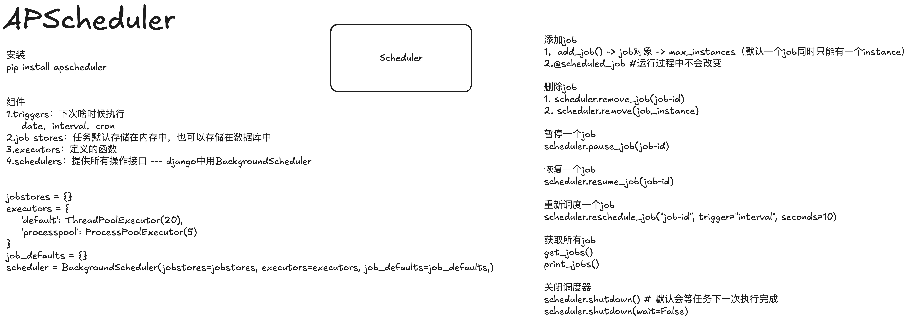

## APScheduler

APScheduler比较适合用来执行周期性任务
celery比较适合用来执行异步任务

官方文档: https://apscheduler.readthedocs.io/en/latest/userguide.html

1. EVENT事件

EVENT_SCHEDULER_STARTED
EVENT_SCHEDULER_START
EVENT_SCHEDULER_SHUTDOWN
EVENT_SCHEDULER_PAUSED
EVENT_SCHEDULER_RESUMED
EVENT_EXECUTOR_ADDED
EVENT_EXECUTOR_REMOVED
EVENT_JOBSTORE_ADDED
EVENT_JOBSTORE_REMOVED
EVENT_ALL_JOBS_REMOVED
EVENT_JOB_ADDED
EVENT_JOB_REMOVED
EVENT_JOB_MODIFIED
EVENT_JOB_EXECUTED
EVENT_JOB_ERROR
EVENT_JOB_MISSED
EVENT_JOB_SUBMITTED
EVENT_JOB_MAX_INSTANCES